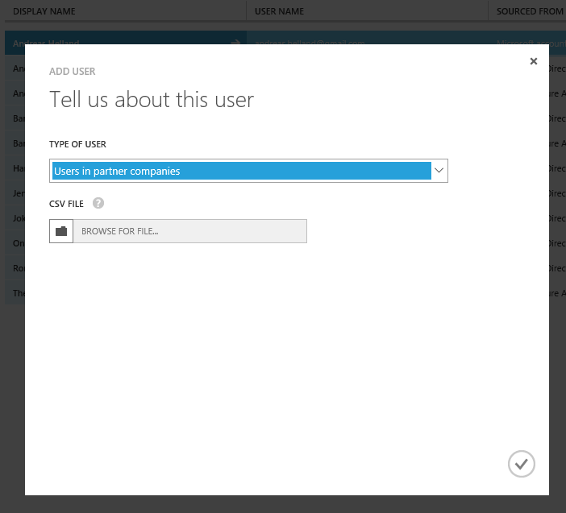
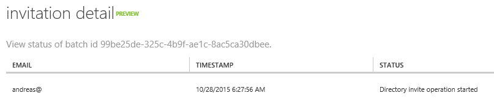
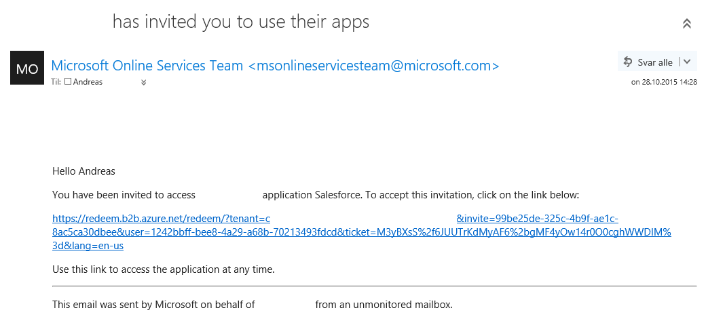
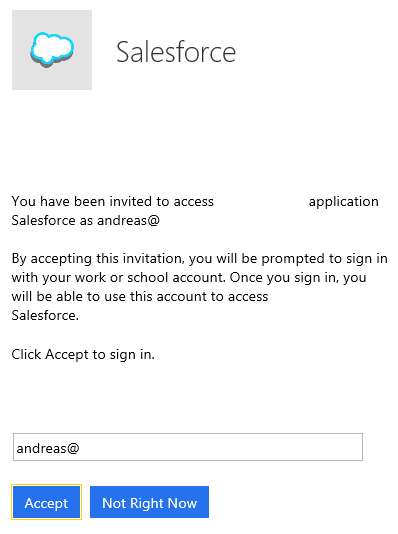
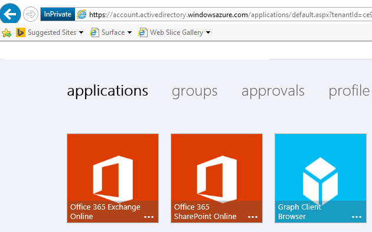
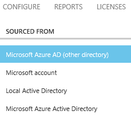

<properties
	pageTitle="Azure Active Directory B2B"
	description="Enabling Business2Business scenarios with Azure AD"
	slug="aadb2b"
	order="500"
	keywords="Azure AD, AAD, B2B"
/>

On-premise Active Directory has put some requirements on your infrastructure, but moving AD to the cloud has removed most of these obstacles. You don't care about replication or the number of domain controllers when it's all in Azure. It has however not easily solved one of the other big issues that has plagued a lot of admins out there for quite a while; how do I let non-employees into my directory? The typical use case for this is having some consultant that needs to access your servers to do work for you. If they come in for a hit-and-run install job you might just log in for them with an account and let them do their business. But if they need access over time, and don't come into your office, that isn't going to work.

Still, consultants are "easy" in the big picture. What about having a joint project with another organization where you need to collaborate on documents, share web apps, etc.? That's even more taxing.

The collaboration scenarios have typically been solved for things like Lync/Skype for Business by setting up federation between the organizations. This works fairly good once you've got it up and running. The challenge with this approach is two-fold; not every organization out there has a setup suited for federation. If you have on-prem Skype for Business you probably have a server or two already, and adding a few more for something like ADFS isn't necessarily an issue. But if you have a smaller organization, and you don't have the necessary solutions in place getting one going usually has some level of complexity to it. Disregarding the complexity involved in implementing these products, some of the solutions in the market has a high price tag attached to them as well.

Even if you overcome these factors the problem is scaling. Granted, if you only have a few companies you're working with this isn't something you need to worry about. If you have a lot of partners/customers/etc. you're working with setting up federations for all of them is probably going to become less enjoyable over time.

Enter Azure AD B2B to assist.

**Note: the service is in preview, and things might change between writing this and the release going GA.**

AAD B2B doesn't remove the concept of federation, but it takes the work away from you. If you use AAD, and an organization you work with also has AAD you both have "stuff" in Azure so wouldn't it make sense that Microsoft handles this for you? Yes, it would, and that is what AAD B2B will leverage.

If you have resources in your AAD tenant you can invite users from other AAD tenants to be linked to your resources. They login with their existing credentials, but gains access to your data through a federation not visible to you.

It's not an AAD-only thing either, you will be able to invite users not in an AAD tenant as well, with the option for them to step up to getting one should they like. The only restriction for now is that the external users cannot have a consumer email provider like Gmail/Outlook.com.

Let's go through the necessary steps for setting this up between two organizations. Both of these organizations has an Office 365 subscription, and an associated Azure AD tenant.

Go to the Active Directory section in the legacy Azure portal [https://manage.windowsazure.com](https://manage.windowsazure.com), navigate to the Users tab, and click "Add User".  


You should select "Users in partner organizations" as the user type. As you can see this currently requires uploading a csv-file to progress.

The csv-file has a format like this:  
```xml
Email,DisplayName,InviteAppID,InviteReplyUrl,InviteAppResources,InviteGroupResources,InviteContactUsUrl
andreas@contoso.com,Andreas,cd3ed3de-93ee-400b-8b19-b61ef44a0f29,,,,http://contoso.com

```

The invite is sent via mail to the external users. You can verify the status of the invite in the management portal. (If your csv-file is incorrect you will also be notified.)  


The invited user receives a mail with a unique link:  


Once they click it they will need to accept/confirm.  


The same link can be reused later, but it's probably easier to save a favorite for the following url:  
[https://myapps.microsoft.com/](https://myapps.microsoft.com/)

In addition to the apps of your own organization, you should have an extra icon for apps belonging to other organizations:  


At the moment you can't tell the difference between the apps based on your organizational belonging.

If you browse to the Users tab of the AAD section in the portal you will see be able to see the external user as an AAD account (Other directory).  


As you can see this is a fairly friction-free process with a minimum of configuration needed. Even without deep knowledge about Identity Management this is achievable.