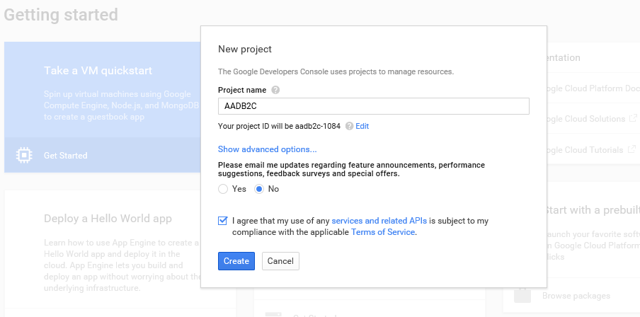

<properties
	pageTitle="Google IdP"
	description="Adding Google as an Identity Provider (IdP) for B2C."
	slug="aadb2cgoogleidp"
    order="200"
	keywords="b2c, azure ad b2c, aad, social identities, google idp"
/>

## Setting up Google for use as an Identity Provider (IdP)

Once you have a B2C tenant created you will need to have Identity Providers (IdP) configured before you're able to create necessary policies for signing up and in. As the name suggests these are the entities that will provide identiies, like AD/AAD itself would be a in a non-B2C setup. The list of providers is limited at the moment, but will be added to in the future. 

This part of the guide covers how to use Google as your IdP. 

Navigate to the Google Developers Console: [https://console.developers.google.com](https://console.developers.google.com) and create a new project.  

Make sure you have selected this project and select "Credentials" in the left-hand menu.  

You need to go to the "Oauth consent screen" tab first and enter a project name. (You can ignore the other settings.)  

Go back to the "Credentials" tab. There should be a centered dialog box with the option to "Add credentials".  

Choose the "Oauth 2.0 client ID" option from the dropdown.  

Next select "Web application" as the type of app.  
Enter [https://login.microsoftonline.com](https://login.microsoftonline.com) in the "Authorized redirect URIs" field.

When you click "Create" you will get a client id and a client secret that you need to write down as they will be used when adding the IdP in the Azure portal.  

You will need to add an additional redirect URI as well, which requires navigating back to the properties of the credential you just created.  
This URI should be [https://login.microsoftonline.com/te/contosob2c.onmicrosoft.com/oauth2/authresp](https://login.microsoftonline.com/te/contosob2c.onmicrosoft.com/oauth2/authresp) where contosob2c should be replaced with your tenant's name.

With this in place you are ready to create policies in the Azure portal.

For more information refer to the Oauth 2.0 implementation on the Google side:  
[https://developers.google.com/identity/protocols/OAuth2](https://developers.google.com/identity/protocols/OAuth2)
