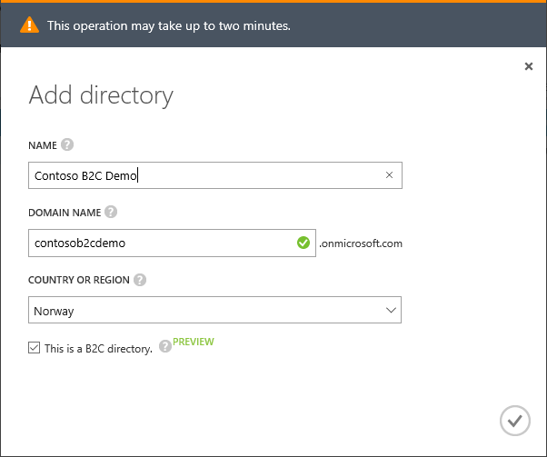
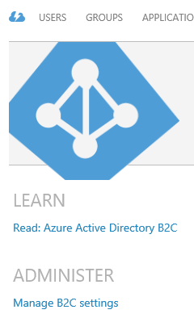
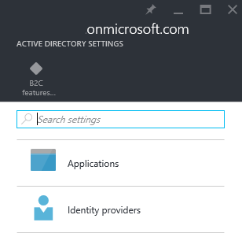

<properties
	pageTitle="B2C Intro"
	description="AAD B2C enables logins through social identity providers in an AAD setting."
	slug="aadb2cintro"
    order="100"
	keywords="b2c, azure ad b2c, aad, social identities"
/>

## Creating an Azure Active Directory B2C tenant

The premise of this guide being about Azure Active Directory it's a given that it's the best identity platform since sliced bread. There has however been a couple of caveats with AAD for specific use cases. Of the web sites the average user logs in to every day not all of them are corporate sites where their business identity is the logic choice. Or for that matter; if your customers interact with you through a web site you might not want to provide them with corporate identities in your AD.

For these purposes there is a new service in Azure AD called AAD B2C that is currently in preview. It works mostly like a normal AAD tenant from the developer and management side of things, but instead of issuing identities like joe@contoso.onmicrosoft.com the user can login with larry@gmail.com and mark@facebook.com. Logging in with social identities is not a new concept. There's a lot of web sites out there already offering "Log in with Facebook" and similar options. The goal of this guide is not to compare all the options, or opine on which one is the most suited for particular scenarios. The intent is to show how AAD now enables these use cases, and how the Azure take on it is.

The high level goal is that from the "B-side" you should think of this as AAD, and from the "C-side" you should see a plain old login system without giving AAD and Microsoft a thought. An important distinction from a corporate Active Directory is that parts of the functionality you would want in a business directory are disabled so the scenario where one user can look up the info of another user is not available. Which is usually something you want when you have a bunch of consumers in the same database.

**Note: the service is in preview, and things might change between writing this and the release going GA.**

The first thing you need to do is create an AAD tenant specifically for B2C. 
Go to the old portal:  
[https://manage.windowsazure.com](https://manage.windowsazure.com) 

Create a new Azure AD tenant by following this flow:  
New->App Services->Active Directory->Directory->Custom Create  
Check "This is a B2C directory".  

Afterward click "Manage B2C Settings" and you will be thrown into the new portal to do the rest.  
  

A service like AAD B2C has both a developer part and an admin part to fully get going. Since the developer isn't able to do much without some configuration in place we will do the admin parts first. 

Follow along by going through the sections in the menu.
