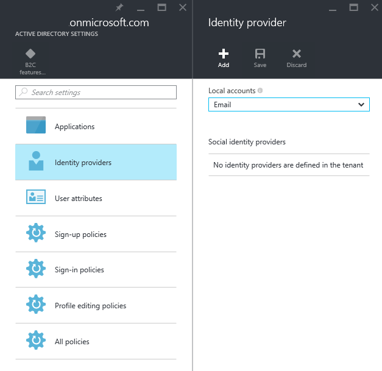
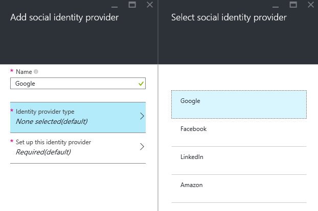
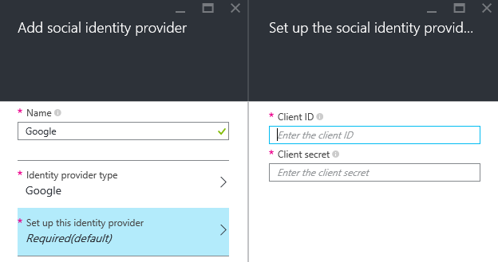
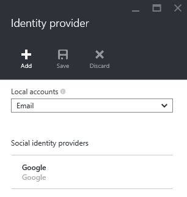
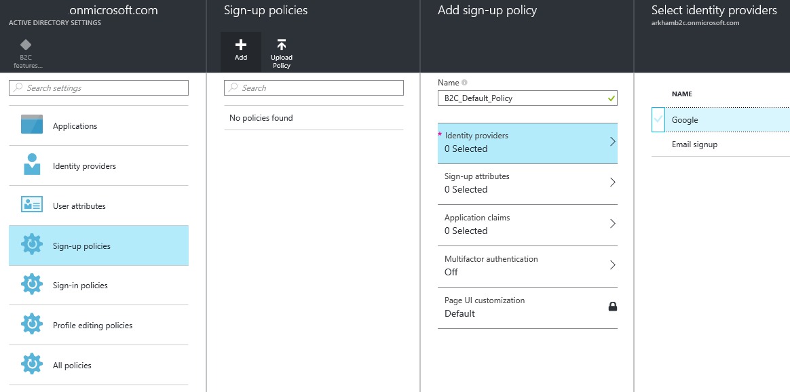
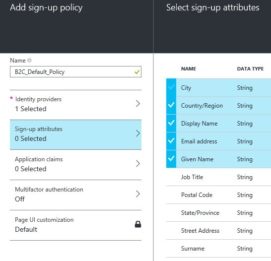
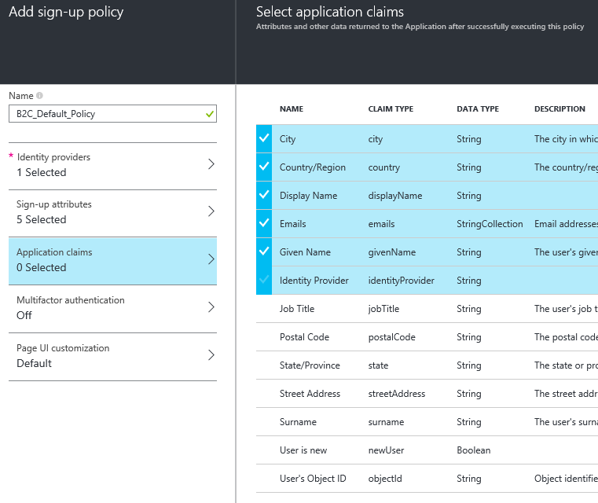
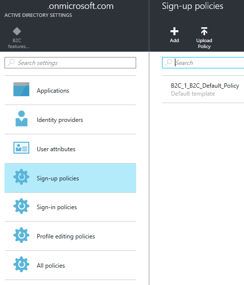
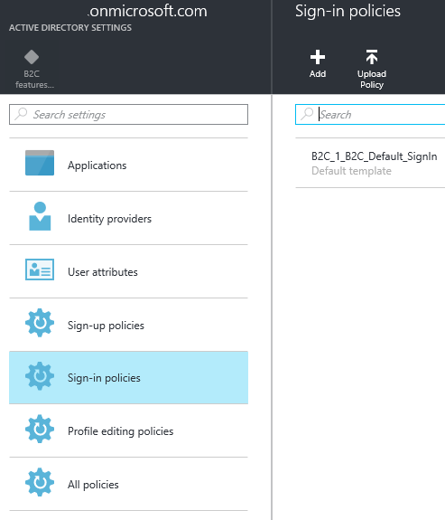
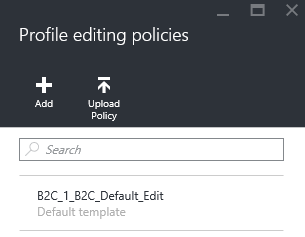

<properties
	pageTitle="B2C Policies"
	description="Creating B2C policies."
	slug="aadb2cpolicies"
    order="300"
	keywords="b2c, azure ad b2c, aad, social identities, policies"
/>

## Creating necessary policies for the Azure Active Directory B2C tenant

After creating an entry for B2C on the Identity Provider end of things you should return to the B2C portal.

While you could certainly integrate your apps directly with the IdPs the whole point of B2C is to abstract this away from the apps and have a middle layer handling this complexity. For this reason configuration must be done in the form of setting up policies in the portal that dictates how sign-up, sign-in and profile editing works. Let's go through setting up a basic setup.

The first step is adding the Identity Providers we want to use.  

Click "Add", and select "Google". (Matching what was done in the previous part.)  

We need to enter the client ID and client secret for the Google integration:  
  

Next thing we need are signup policies. These control the requirements for signing up/creating an account in the system. While the user will already have an account with an IdP they also need an entity in your app.
Click "Add" and start by adding "Google" to the "Identity providers" section.  

The we need to select which attributes we collect as part of the sign up process. If the IdP provide these AAD B2C will collect these, but if the IdP doesn't supply everything the user will need to type it in manually.  

To expose the attributes to the application we need to configure "claims" as well. These claims are added to the token and available during runtime.  

We can have several sign up polices, but one will suffice for now.  

Users will need to sign in on subsequent policies, and there's a separate policy for that. (Settings the same as sign up in this case.)  

For simplicity's sake the Profile editing policy is also the same.  

This concludes the setup part of things, and the next part is writing apps to take advantage of the configuration shown above.
