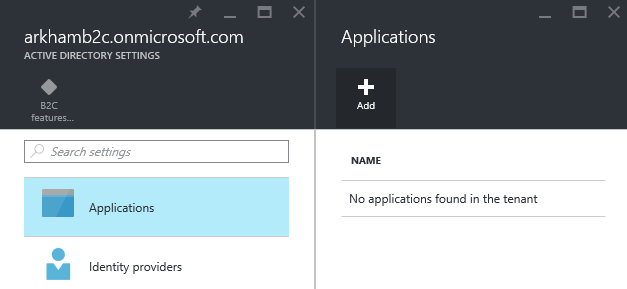
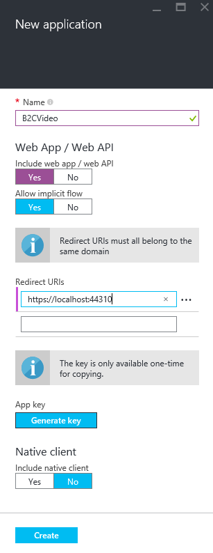
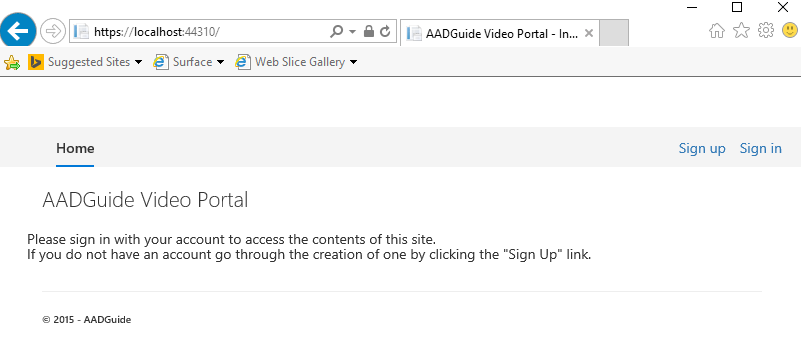
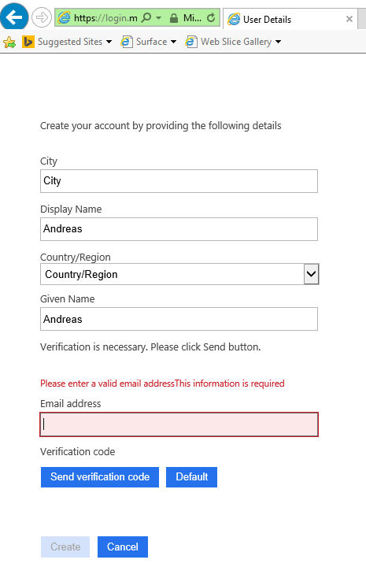
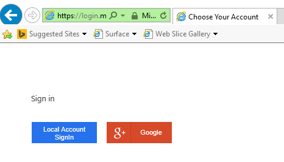
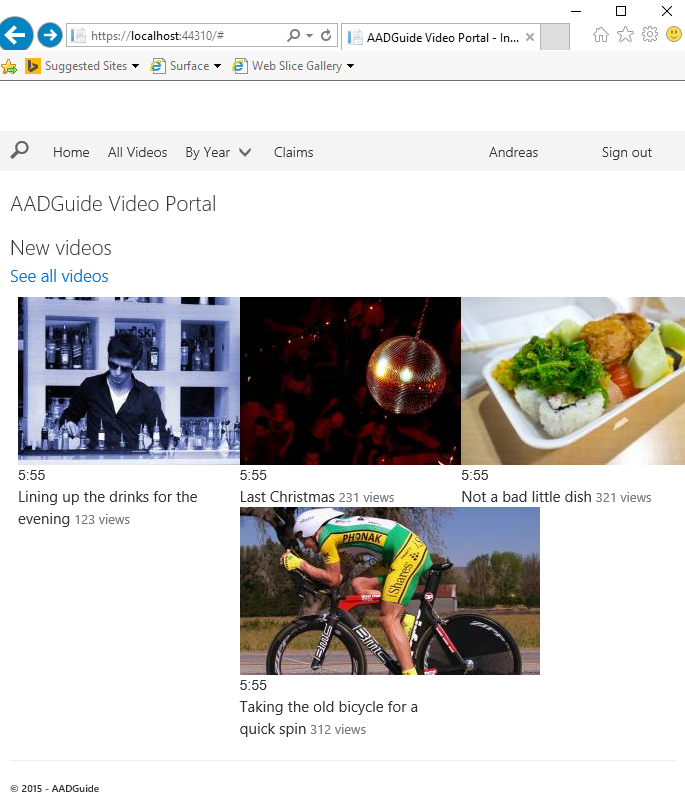
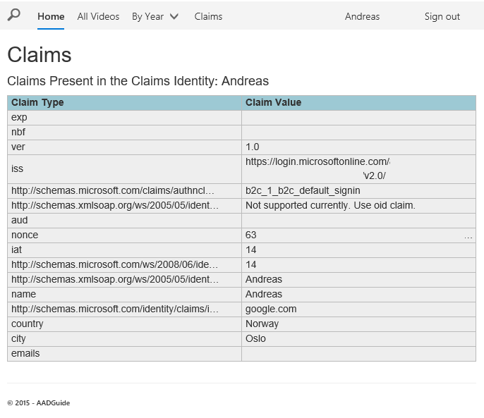

<properties
	pageTitle="B2C VideoPortal"
	description="Sample of a video portal integrated with B2C authentication."
	slug="aadb2cvideoportal"
    order="400"
	keywords="b2c, azure ad b2c, aad, social identities, policies"
/>

Code on GitHub:  
[https://github.com/ahelland/AADGuide-CodeSamples](https://github.com/ahelland/AADGuide-CodeSamples)

Project name: B2CVideoPortal

## Building a web app using B2C authentication

Make sure to go through the previous parts of the B2C config before working through this section.

The intent of this section is to show a simple web app where the end user of the site uses a social id as their identity for signing in on the site.

For an application to be able to leverage B2C it needs to be registered in the AAD B2C tenant. (This is the same concept that applies to non-B2C apps in Azure AD as well.) Navigate to the "Applications" section and click "Add".  


Since we are creating a web app we need to set the switch for "Web App / Web API" to Yes, and specify a redirect URI. Make sure the URI you specify matches what you put into the configuration of the app afterwards.  


Generate a key and write it down as this will also be needed in the app's configuration.

Note: all the steps for building the app is not shown here. This is due to the service being in preview when this guide was written, and thus the code parts are more fluid than for a released service. To not risk screenshots and steps being outdated detailed instructions have been left out. If you do not want to fork this sample you can create a web app with no authentication and add the following parts:

Add NuGet packages (latest stable releases):  
_Microsoft.IdentityModel.Protocol.Extensions_  
_Microsoft.Owin.Host.SystemWeb_  
_Microsoft.Owin.Security_  
_Microsoft.Owin.Security.Cookies_  
_Microsoft.Owin.Security.OpenIdConnect_  
_OfficeUIFabric_  

Also remember to upgrade the pre-included NuGet packages to latest stables.

Add the followng folders:  
_PolicyAuthHelper_  
_Views=>Account_ (subfolder)  

Add these files:  
_...=>Startup.cs_  
_App_Start=>Startup.Auth.cs_  
_PolicyAuthHelper=>HttpDocumentRetriever.cs_  
_PolicyAuthHelper=>PolicyAuthorize.cs_  
_PolicyAuthHelper=>PolicyConfigurationManager.cs_  
_Controllers=>AccountController.cs_  
_Views=>Home=>Claims.cshtml_  
_Views=>Shared=>_LoginPartial.cshtml_  

Remove these files:  
_Home=>About.cshtml_  
_Home=>Contact.cshtml_  

Either copy & paste the contents of the files from the GitHub repo, or type them off manually for working it into your fingers. (You would also need to replace the contents of the templated cshtml files.)

This sample is based on the official documentation:  
[Azure AD B2C Preview: Build a .NET web app](https://azure.microsoft.com/en-us/documentation/articles/active-directory-b2c-devquickstarts-web-dotnet/)

The UI is based on Office Fabric UI (the OfficeUIFabric NuGet package) to give a more recognizable feel to it for those who use Office 365 and 2016. This step is entirely optional, but the css is based on having this component available so you'll need to rewrite the views if you don't want to use it. If you want to know more about what this component is check out the Office Dev Show:  
[Office Dev Show - Episode 12 - Office UI Fabric](https://channel9.msdn.com/Shows/Office-Dev-Show/Office-Dev-Show-Episode-12-Office-UI-Fabric)

The app will be a video portal for "home use". The use case being that as a developer you have a couple of home videos you want to share among your family, that you don't want to upload to YouTube/SnapChat/etc. for the whole world to see, yet you also want to authenticate users while not having to create and manage their identities. (Because no IT person in their right mind would want to create extra support work for themselves by doing so.) There are existing solutions for this, but it should work as a proof-of-concept.

The app shows a simple UI instructing you to sign in or sign up when you arrive anonymously at the root page.  


Let's look at what it takes to get there.

If you try to build the sample provided on your own dev station you need to check the settings in the web.config file:
```xml
<add key="ida:Tenant" value="xyz.onmicrosoft.com" />
<add key="ida:ClientId" value="GUID" />
<add key="ida:AadInstance" value="https://login.microsoftonline.com/{0}{1}{2}" />
<add key="ida:RedirectUri" value="https://localhost:44310/" />
<add key="ida:SignUpPolicyId" value="B2C_1_B2C_Default_Policy" />
<add key="ida:SignInPolicyId" value="B2C_1_B2C_Default_SignIn" />
<add key="ida:UserProfilePolicyId" value="B2C_1_B2C_Default_Edit" />
```

If you followed the previous sections to set this up only "ida:Tenant" and "ida:ClientId" will be specific to your instance. Make sure to adjust the other appSettings as well if you named things differently or used a different redirect URI.

The first step as a user is to sign up for an account. While there are different providers to choose from the steps below show what it looks like using Google. As an aside - the reason a Microsoft account is not used is that the support for this has not been added to AAD B2C yet, but it will be available at a later point in time.  


This also demonstrates how the user is prompted to provide the extra info configured in the policies that is not provided by the chosen IdP. (In this case Google, so with a different IdP different data might be exposed.)

If you head to sign in (after you have registered) it will look like this:  


The index page is filled with dummy data populated with stock images in place of videos, so it doesn't actually work, but it should be easy to replace with code extracting values from a database back-end.  


There's also an extra tab on the menu that you would normally not expose outside of debbuging purposes in the form of a "Claims" link. This will list all the claims attached to the token of the user.  


This just scratches the surface of the B2C integration from a developer standpoint, and examining the code remains. Upcoming sections will go into more detail.