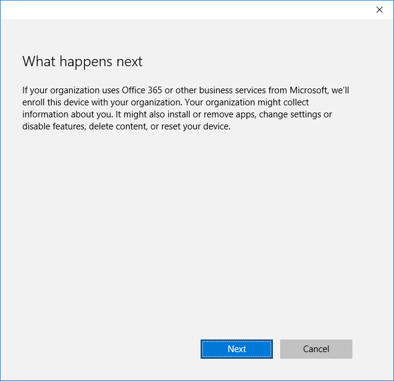

<properties
	pageTitle="Azure AD Join"
	description="Joining your Windows 10 computer to an Azure Active Directory Domain."
	slug="aadjoin"
    order="300"
	keywords="Azure AD, AAD, AAD Join, Windows 10"
/>

I stated on the introductory page that Azure AD was different from Active Directory on-premises in a couple of ways. One of the most notable pieces missing is that while you can have user accounts in Azure AD you cannot have computer accounts, and join computers to the domain. Well, that is due to change with Windows 10 with a feature called "Azure AD Join".

**Note: This walkthrough is up to date as of Windows 10 build 11082. If you are running a different build things might look slightly different, but the basics have been consistent since pre-RTM.**

So, what is this? Well, if you've installed Windows 8 or 8.1 you'll no doubt have witnessed how you're supposed to use your Microsoft Account for signing in instead of using a local account. There are pros and cons to this approach, and some might prefer using local accounts instead. If you're using your Windows in a work environment both those options are often uninteresting and you'll want to join an Active Directory domain and use domain accounts instead, and that approach still works in Windows 10.

When you want to join computers to the domain you really want to be on the company network though, and while you can do a join while connected via VPN on a non-domain account that is a bit of a hassle. Since everyone's talking about the cloud non-stop there should be a different way to solve this right? Well, Azure AD Join might be that way.

As the name of the feature implies this is a way for computers to join a directory running in Azure AD. You can still have your on-prem domain, and a hybrid setup, but you don't have to join the computers through the on-prem domain controllers.

There are two ways this join can be done. Either as part of the OOBE (Out Of Box Experience), meaning that when you remove the shrinkwrap and boot up your new laptop for the first time you choose to enroll directly before logging into Windows. This would be suitable for company owned devices where you're not supposed to use a local account. The other option is doing the Azure AD Join after logging in with a local account first. This is suitable if an employee owns the laptop themselves and has a valid need for having a local account in addition to the company issued credentials. There is the possibility that the Azure AD Join enforces some policies that you might not like to have applied to your laptop, but this is not a discussion on who owns/manages/etc. on a given computer. Azure AD Join might be a perfect fit for some, and might be undesired by others - I'm just showing the technical bits.

The details of the OOBE experience are not finalized yet. It may very well be that the behavior is slightly different depending on which SKU of Windows 10 you have on your computer. It will most likely also tie into other coming features like upgrading a SKU where you might start with a Home SKU, do the OOBE join, and get upgraded to Enterprise once you sign in. Once the details are more clear the guide will be updated.

Let's take a step through of what it looks like when you start the experience from within Windows. The normal OOBE has been completed, and a local account has been created and is logged in.

You need to go to the Azure portal first and enable "Device Registration". 
You need to use the old portal at [https://manage.windowsazure.com](https://manage.windowsazure.com).
Find your tenant name under the Active Directory menu item, and go to the "Configure" tab.
Make sure "Users may Azure AD Join devices" is set to all or selected.

Open up the new Settings panel in Windows 10 and go to System->About. Then click "Join Azure AD".

A brief introductory text.

Enter your credentials. If you have customized the branding for your tenant that will be applied when you focus on the password box.

To ensure you know you're enrolling to the right company you have to confirm this.

Wait a couple of seconds while some traffic shuttles back and forth in the background.

And we're done!

After rebooting you will need to choose "Other user" on the login screen as opposed to the local account we used previously.

Type in the credentials in the form of a full UPN (or email address as you're likely to say to the end-users if you haven't modified the defaults).

If you decide later that this isn't something for you there is an option to "Disconnect from organization".

What happens next depends on a couple of factors. You might be prompted to provide a PIN code as an alternative method of signing in. This is part of the Hello/Passport feature to move away from passwords. This has worked in previous builds, but does not seem to be present in this build. There is also the possibility that the join triggered an MDM enrollment, and that your device is now busy pulling down apps and policies. This might be covered in a different guide at a different time. The basic Azure AD Join experience ends here for now :)