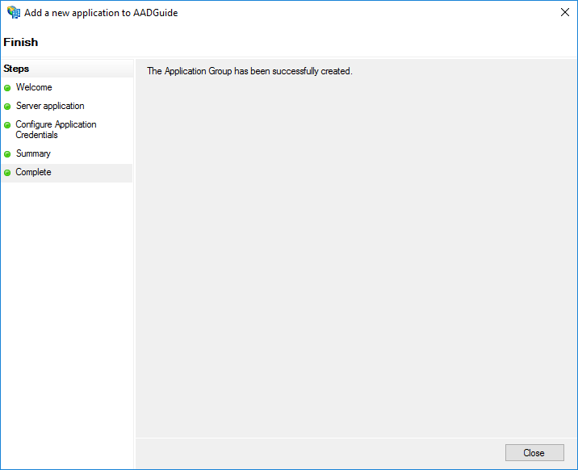

<properties
	pageTitle="Application Groups"
	description="Setting up Application Groups and Apps in ADFS 2016"
	slug="appgroups"
	order="200"
	keywords="Azure AD, AAD, ADFS 2016"
/>

In this walkthrough we will attempt to replicate the scenario described in the WebAPISingleTenant walkthrough using ADFS instead of Azure AD. The purpose is to show the differences, while also highlighting how much of the code is similar between the two configurations.  
For reference:  
[http://aadguide.azurewebsites.net/integration/webapisingletenant](http://aadguide.azurewebsites.net/integration/webapisingletenant)

This is part 1 (of 2) - configuring the ADFS Server.  
Part 2 covers the code.  
It is assumed that ADFS 2016 is already installed on a server.

**Note: ADFS 2016 is still in beta. The following walkthroughs are based on Technical Preview 4 (Build 10586).**

Open the ADFS Management Console, right-click on "Application Groups", and click "Add Application Group":  


Select  "Server Application or Website", and hit "Next":  


Enter https://localhost:44320 as the redirect URI and "Add it". Copy the "Client Identifier", and hit "Next":  


Check "Generate a shared secret", and copy it to the clipboard (and preferably into a text file afterwards):  


Confirm that things look right:  


Hit "Close" if it was successful:  


Next we need to add a Web API:  


We need to create an identifier for the app - as long as it's unique you're good:  


We need to assign a policy. For simplicity we choose "Permit everyone":  


Make sure "openid" is checked as the scope:  


Confirm that things look right:  


And success:  


We should also add a "Native application" for use in a Universal Windows Platform app:  


For the moment we fill in a placeholder value for the redirect URI as we have not built the app yet. When we have the id we need to revisit this page:  


Confirm that things look right:  


And success:  


You should now have the following applications in the application group "AADGuide":  


Afterwards you need to grant access to the Web API for both the Native and the Server App:  


You should also have a couple of future variables written down:  
```cs
var serverapp_ClientId = "a1b2c3";
var serverapp_RedirectURI = "https://localhost:44320";
var serverapp_ClientSecret = "a1b2c3";
var webAPI_Id = "https://aadguide.azurewebsites.net/WebAPI";
var uwpApp_ClientId = "a1b1c3";
var uwpApp_RedirectURI = "ms-app://xyz";
```

You will need these when you head over to the next part.
