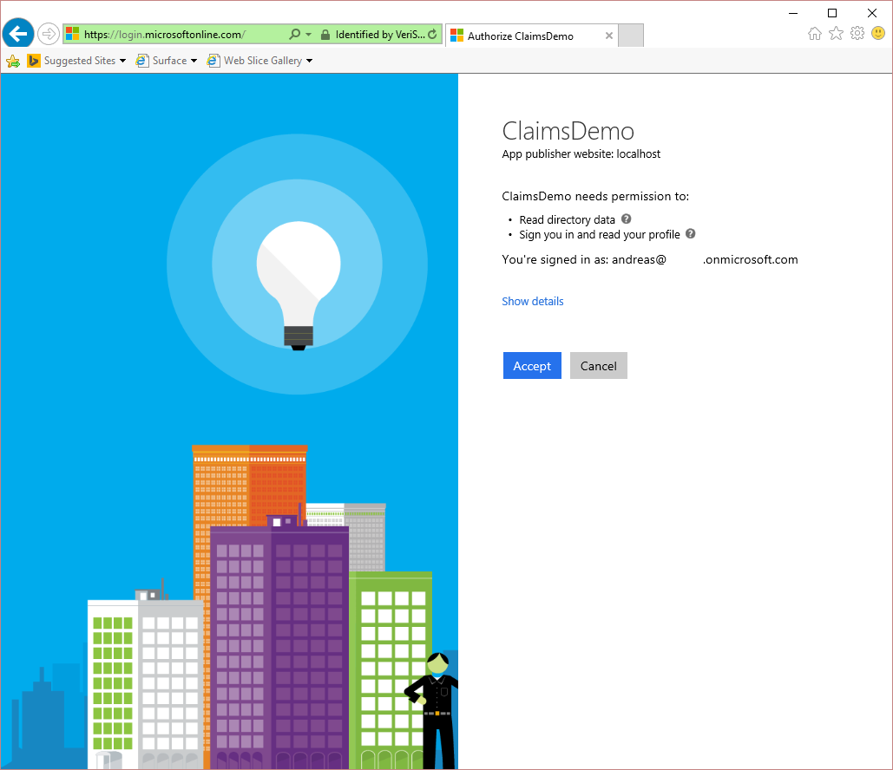
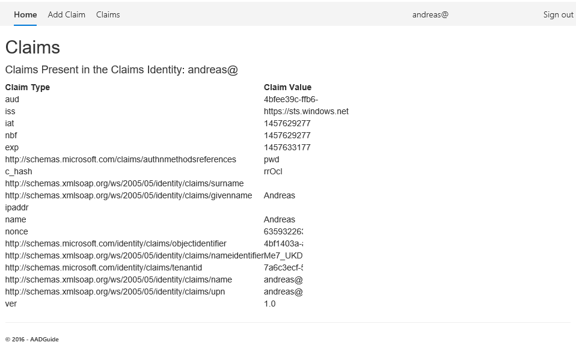
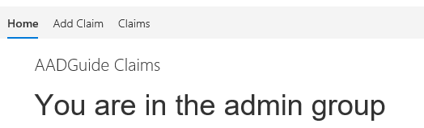

<properties
	pageTitle="Claims"
	description="The what and why of claims, and how to use them."
	slug="claims"
	order="700"
	keywords="Azure AD, AAD, Claims, Claims-based, Claims Transformation"
/>

Apps are often said to be claims-aware, or claims-based, and often not much more explanation is given. But what does this mean?

The short answer is that claims are in most cases the same as an attribute or property of the user object. Claims are usually key/value-pairs attached to the user object in some way. For instance the user Bob could have a claim with the name "email" and the value "bob@contoso.com".

The way the claim is a part of the user object depends on the type of solution you are working on. If you are creating a line of business app which will run in an on-prem environment in close proximity to a farm of domain controllers maybe you don't use claims as part of the login process. Maybe you perform authentication to authorize the user, but whenever you need to know something about the user you make a direct query against Active Directory.  If you were to sign in to your mobile operator's end-user portal however you probably would not be in their Active Directory, and the phone number is possibly stored in the token you receive upon signing in.

In browser-based applications there is a limit to how much data you can store in a token/session/transfer so you should not think of this as a way to load everything about the user onto the client side. You should restrict yourself to key pieces of info needed directly in the app, or attributes commonly used for enabling other lookups.

An example of using claims for looking up other info would be the example of the mobile operator login. You as a user consider the phone number to be the identifier, but the mobile operator might not use that as an identifier because there are multiple levels in the hierarchy that you don't see. This could be how a phone number might have one user as the end-user, whereas a different entity (user or company) might be the legal owner of the subscription. And a subscription might have more than one phone number in case you have a separate sim card for data traffic on a tablet. This means that there could very well be a chance they are using an id that means nothing to you, but would be very relevant for the web app to have knowledge of. So behind the scenes that id is stored in a claim. (Note that this identifier is not something kept secret from you, there's just no intrinsic value for you to be aware of it.)

Or take a video streaming app that works in multiple countries. When you sign up your country is returned in a claim, so that when you initiate streaming the app contacts servers specific for that country. (This is a hypothetical use case; this is not how a global streaming company would do it - Content Delivery Networks are more likely to be involved to solve this in a good manner.)

### Single-tenant, multi-tenant, and Single-Sign On ###
Why is this relevant? Can't we just do a lookup in a database for most of these things?

In an enterprise setup were everything is running in the same datacenter, and everything is behind the same firewall, and controlled by the same people one could argue that it's not as important. The developer might be able to solve the use case with or without the use of claims.

When you start developing apps that work across multiple tenants, and possible federating with other identity providers, things get more complicated. Let's say you have a web app that offers login through Facebook. It's perfectly valid to not implement a user management system of your own, and rely on third-parties, but it would still be required to know something about the user. For instance the web app could use johndoe@facebook.com as the id/login, but it would be nice if the landing page after login said "Hi, John!" instead of greeting the user with their email address. Facebook would certainly have both your given name and surname stored in their records. But they wouldn't allow other apps than their own to tap directly into that database. This is solved by adding claims to your token when logging in. The web app can then use these properties without ever having access to your entire Facebook profile.

The challenge with integrating identity providers and using the claims provided is that there is no standard for what you can expect to get. Facebook might be ok with returning claims that Google do not provide, and vice versa. This means that if you are implementing an app you should always check to see that you get the info you need from the identity providers you support.

As an end-user it can also be a confusing experience. Using a Google account might be very convenient for signing in, but Google might know a lot about you, and you might not want to share all of that with a third-party. Google, and other major players, will usually present a consent screen indicating the type of information shared. (This isn't technically the specific claims they send, but should still be considered to be closely related to that.)

An example of how this could look for a sample Web App using Azure Active Directory:


### Claim transformation ###
A term that is also often referred to when talking about claims is "claims transformation". This is the process of "doing something" to the claims. For instance, maybe the identity provider has a claim called "email". But the web apps database structure refers to this as "mail". You could handle this at the database layer, and adjust your SQL accordingly, but it would also be possible to do this as part of the login process. When the browser returns from the external identity provider you "transform" the claim to suit your naming scheme. You would need custom adapters to handle the different providers, but your core logic doesn't need modification, and adding additional providers doesn't affect the database or anything like that. (Note: regardless of claims transformation you are likely to have to add custom handling of each identity provider.)

### Claim augmentation / enrichment ###
You can do more than just transform the claims though as there will usually be a collection of claims, and you might need more or less info than the defaults supplied.  

Let's say you have a multi-tenant web app with a structure consisting of companies and users within them. The app is created by Contoso, and their users should be able to manage all tenants. The external identity provider treats bob@contoso.com and john@northwind.com the same - they're both users with a specified set of claims. However you know Bob is different since he works at Contoso. So when a user signs in with @contoso.com as the suffix of their user name you add a claim called "AdminUser" with a value of "true". For users signing in with a different suffix this claim will not be present. When the user tries to access parts of the web app that are only intended for admins the claims are checked, and access will be granted/rejected accordingly.

The distiction between these terms is loose so you will often see "transformation" used when something is added to the collection as well. This is usually not a problem as long as you understand that both actions can be performed, and what purpose you are trying to achieve.

### Claims in Active Directory and Azure Active Directory ###
In on-premise Active Directory one often uses Active Directory Federation Services (ADFS) to add claims functionality since AD itself does not deal with this. In Azure Active Directory claims are native to the product, and doesn't require additional solutions. (Remember: AAD is all about SAML and OAuth, and not LDAP and Kerberos.) It is not at parity with ADFS for the moment, so you might feel you're lacking some of the flexibility, but you should always think through the use cases you're trying to implement to consider your options. Using AAD in conjunction with ADFS is also a valid scenario, although this requires a hybrid infrastructure.

## What it looks like ##

Code ahead - ignore if you're not into that. The full code can be located on GitHub:  
[https://github.com/ahelland/AADGuide-CodeSamples](https://github.com/ahelland/AADGuide-CodeSamples)  
Project name: ClaimsWebApp

### Listing out claims ###
Taking a look at the claims of the signed-in user requires only a few lines in code.

We actually do not need to do anything in the controller, but here we can see how we extract the name claim and pass to the view to be used as a header.
```cs
public ActionResult Index()
{
	Claim displayName = ClaimsPrincipal.Current.FindFirst(ClaimsPrincipal.Current.Identities.First().NameClaimType);
	ViewBag.DisplayName = displayName != null ? displayName.Value : string.Empty;
	return View();
}
```

The view takes care of outputting the claims in a table. 

```html
@using System.Security.Claims
@{
	ViewBag.Title = "Claims";
}
<h2>@ViewBag.Title</h2>

<h4>Claims Present in the Claims Identity: @ViewBag.DisplayName</h4>

<table class="table-hover claim-table">
	<tr>
		<th class="claim-type claim-data claim-head">Claim Type</th>
		<th class="claim-data claim-head">Claim Value</th>
	</tr>

	@foreach (Claim claim in ClaimsPrincipal.Current.Claims)
	{
		<tr>
			<td class="claim-type claim-data">@claim.Type</td>
			<td class="claim-data">@claim.Value</td>
		</tr>
	}
</table>
```

This is how it looks like when signing in with Azure Active Directory:


### Adding a claim ###

The process for adding your own claim to the token can be done as follows:
```cs
public ActionResult AddClaim()
{
	Claim displayName = ClaimsPrincipal.Current.FindFirst(ClaimsPrincipal.Current.Identities.First().NameClaimType);
	ViewBag.DisplayName = displayName != null ? displayName.Value : string.Empty;

	//ClaimType, Value, ValueType, Issuer
	Claim localClaim = new Claim(ClaimTypes.Webpage, "http://localhost", ClaimValueTypes.String, "AADGuide");
	
	//Method 1 - short version
	ClaimsPrincipal.Current.Identities.First().AddClaim(localClaim);
	
	//Method 2 - slightly longer version
	//var user = User as ClaimsPrincipal;
	//var identity = user.Identity as ClaimsIdentity;
	//identity.AddClaim(localClaim);    
	
	return View();
}
```

Notice how there is an additional claim at the bottom of the list:


### Removing a claim ###

You can also remove claims should you need to:

```cs
public ActionResult RemoveClaim()
{
	Claim customClaim = ClaimsPrincipal.Current.FindFirst(ClaimTypes.Webpage);

	var user = User as ClaimsPrincipal;
	var identity = user.Identity as ClaimsIdentity;

	ClaimsPrincipal.Current.Identities.First().RemoveClaim(customClaim);
	return View("Claims");
}
```

### Transform / enrich claim ###
This one is a bit more interesting, and refers to how you can inject custom handling of the claims during login. In our example we want to check which tenant id the user is signing in with, and if they are from a specific tenant they will be assigned an "Admin" role.

The output is similar to the previous ones:


This requires a slight bit of extra work in code.  
**Note: this is built for the OWIN middleware used by the new templates in Visual Studio. If you're not using OWIN the approach is slightly different.**

Add an AppBuilderExtension to the _Startup.Auth.cs_ file:
```cs
public static class AppBuilderExtensions
{
	public static IAppBuilder UseClaimsTransformation(this IAppBuilder app)
	{
		app.Use(typeof(ClaimsTransformationMiddleware));
		return app;
	}
}
```

Add _app.UseClaimsTransformation();_ to the _ConfigureAuth_ method in the same file.  
```cs
		});
	app.UseClaimsTransformation();
}
```

Add a new class _ClaimsTransformationMiddleware.cs_
```cs
public class ClaimsTransformationMiddleware
{       
	readonly Func<IDictionary<string, object>, Task> _next;       

	public ClaimsTransformationMiddleware(Func<IDictionary<string, object>, Task> next)
	{
		_next = next;
	}
	
	public async Task Invoke(IDictionary<string, object> env)
	{
		ClaimsPrincipal incomingPrincipal = Thread.CurrentPrincipal as ClaimsPrincipal;
		if (incomingPrincipal != null && incomingPrincipal.Identity.IsAuthenticated == true)
		{
			ClaimsIdentity claimsIdentity = incomingPrincipal.Identity as ClaimsIdentity;
	
			string tenantId = incomingPrincipal.FindFirst("http://schemas.microsoft.com/identity/claims/tenantid").Value;
			
			//Replace with tenant id for xyz.onmicrosoft.net
			string adminTenant = "1234";

			if (tenantId == adminTenant)
			{
				((ClaimsIdentity)incomingPrincipal.Identity).AddClaim(new Claim(ClaimTypes.Role, "Admin", ClaimValueTypes.String, "AADGuide"));
			}
			Thread.CurrentPrincipal = incomingPrincipal;        
		}
		await _next(env);
	}        
}
```

Notice we perform an if check to compare the tenant ids, and add a new claim as appropriate.

Afterwards you can do things like this in your view:
```html
if (User.IsInRole("Admin"))
{
	<h1>You are in the admin group</h1>
} 
```  

Making the view look like this:  


Things can easily get bloated if you overuse the technique, but it's easy to see how this could come in handy in some scenarios.