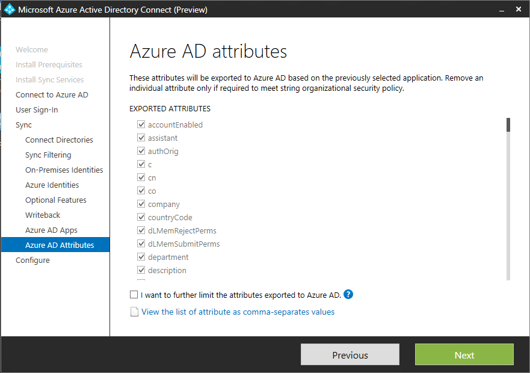

<properties
	pageTitle="AAD Connect"
	description="AAD Connect is the vehicle for flowing directory data between the on-prem world and the cloud."
	slug="aadconnect"
    order="200"
	keywords="dirsync, aad connect, aad"
/>

## Azure Active Directory Connect

AAD Connect is currently in a public preview, but will be the preferred sync engine once it goes RTM. This is a guide for installing it in a basic setup. (You will notice the option to branch in different directions along the way, but not all of these will be covered.)

Provided you have the necessary credentials at hand it is a fairly easy installer to follow. For this guide I assume a clean install of Windows Server 2012 R2 with the current updates applied.

Download here:
[https://connect.microsoft.com/site1164/Downloads/DownloadDetails.aspx?DownloadID=53949](https://connect.microsoft.com/site1164/Downloads/DownloadDetails.aspx?DownloadID=53949)

Start the installer.

Agree to the terms, and hit "Continue".

A couple of software pieces are needed as a prerequiste, but the installer takes care of downloading and installing these.

You have the option to provide your own SQL Server, change a few settings or import a settings file. These are all optional, and for this installation I have chosen to go with the defaults (no checked boxes).

Provide credentials for connecting to Azure AD. The account you use must be a global admin.

The express option takes care of most things for you, but I have chosen "Customize" to be able to show the options appearing afterwards.

Here comes a tough choice for some. How to handle logins from users. If you want to keep this on-prem and federate this is where you decide. For this config I have chosen option 1, and use AAD Connect to synchronize the passwords and authenticate the users in the cloud.

For this step you need to type in the credentials of an on-prem user with domain admin rights.

If you have a large number of users and groups, but you know you don't need to sync them all you can filter the selection.

If you have only one domain this isn't of much concern, but if you have multiple domains in a forest and the users might be present in more than one of them you need to specify a uniqueness. I chose to go with option 1.

If your username is something like user@contoso.local you might want to use something different than the UPN for login (since you can't add .local as a domain), but other than that the defaults are ok in most cases.

There's plenty of additional options you can enable in AAD Connect.

By default users and groups created in the cloud stay in the cloud. They don't appear on-prem, and can't be used on-prem. With writeback you can change this to actually have cloud created accounts synced back. This might be useful for users who have most of their stuff in the cloud, but need to sign on to the intranet every once in a while. Plus you get visibility in your on-prem management tools. 

The Office 365 suite of services require specific attributes to be synced, but if you don't want to sync these (possibly because you're not using said service) you can restrict the export.

If you want to go even more granular you can do so.

You probably want to have the sync process started when you're done. Just hit "Install" afterwards.

Things should hopefully look like this when you've gone through the entire wizard.

If you want to verify things you can look up the "miisclient.exe" file in "C:\Program Files\Microsoft Azure AD Sync\UIShell". This UI will give you more detailed info on what went on during the sync process as well as showing you that sync has occured at regular intervals.
