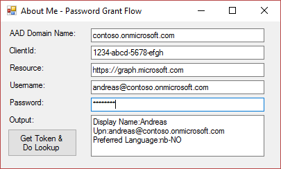

<properties
	pageTitle="AboutMe (sample)"
	description="How to use the OAuth Password Grant Flow."
	slug="aboutmesample"
	order="510"
	keywords="Azure AD, AAD, Integration, Identity, OAuth, Password Grant, Graph API"
/>

This guide consists of a Windows Forms app for retrieving an access token using the OAuth Password Grant Flow. The token is subsequently used for querying the Microsoft Graph API.

Code on GitHub:
[https://github.com/ahelland/AADGuide-CodeSamples](https://github.com/ahelland/AADGuide-CodeSamples)

Project name: AboutMePasswordGrant

### Introduction ###
There are a couple of different ways to authenticate with Azure Active Directory depending on what you are trying to do. This sample app shows how to authenticate using the OAuth Password Grant flow to acquire a token. The use case for this would be when you need to have a user context, (as opposed to the application context client credentials would represent), but in a server type implementation. An example of this would be a daemon service running non-interactively, but needing to access a resource using a user/service account.  

Technically this flow can also be used to implement a custom login UI in web apps instead of using the default Microsoft-provided experience. This is generally not recommended as this requires the app to handle the user credentials directly, as opposed to it being a matter stricly for the client and the Azure AD endpoints. For a single-tenant line of business app this might be considered acceptable, but for a multi-tenant app it would really not be ok that the user needs to hand over their password to a third-party app developer.  

Use this flow with care.

### What it looks like ###
Starting in the opposite end this is what the end result looks like:  


The user credentials by themselves are not enough, you will still need to register an app in Azure AD. If you have a multi-tenant app, or require extra priviliges you will also need to adhere to the rules of the consent framework. (Out of scope for this sample which assumes a single-tenant app only querying the Graph.)

The output shown is an extract from a simple "me" query against the Graph to find out details about the user who authenticated.

### How to ###
The sample app is a Windows Forms app, but this can be made to work in console apps, server back-ends, etc.

Very often when interacting with Azure AD you will want to use libraries to handle the OAuth and OpenID Connect bits to abstract it away from your main code flow. In this code it is explicitly shown how to perform the token acquisition with "plain" http calls without any extra dependencies. This is both to show more clearly what is going on, as well as the fact that this flow is simple enough that you should be able to implement it without something handling redirects and callbacks for you.

The token to acquire the token looks similar to this:

```cs
var domain = "contoso.onmicrosoft.com";
var user = "bob@contoso.com";
var pw = "password";
var clientId = "guid";
var resource = "https://graph.microsoft.com";

HttpClient client = new HttpClient();
string requestUrl = $"https://login.microsoftonline.com/{domain}/oauth2/token";
string request_content = $"grant_type=password&resource={resource}&client_id={clientId}&username={user}&password={pw}&scope=openid";

HttpRequestMessage request = new HttpRequestMessage(HttpMethod.Post, requestUrl);
try
{
 request.Content = new StringContent(request_content, Encoding.UTF8, "application/x-www-form-urlencoded");
}
catch (Exception x)
{
	var msg = x.Message;
	txtOutput.Text = $"Something went wrong: {msg}";
}
HttpResponseMessage response = await client.SendAsync(request);

string responseString = await response.Content.ReadAsStringAsync();
GenericToken token = JsonConvert.DeserializeObject<GenericToken>(responseString);
var at = token.access_token;
```

The full sample also includes the call to the Graph API, and definitions for the JSON for deserialization.