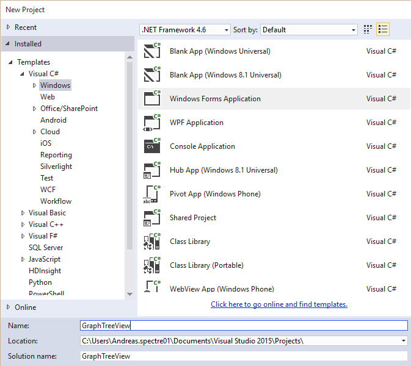
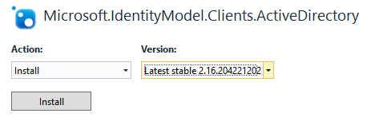
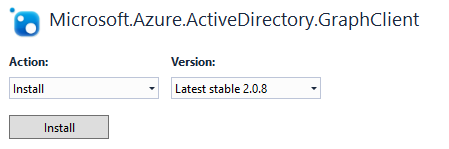
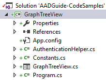
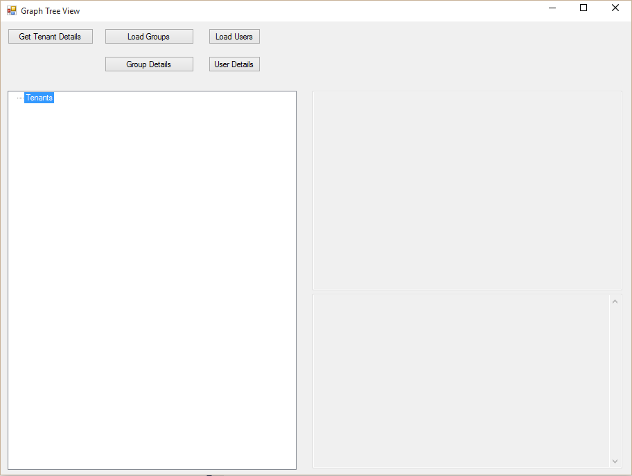
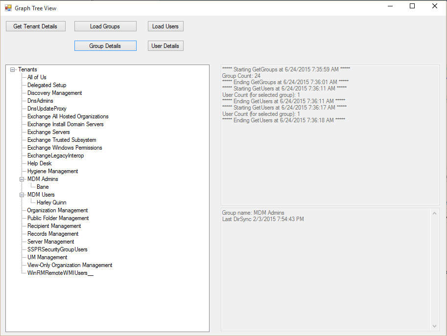

<properties
	pageTitle="GraphTreeView"
	description="How to build a Windows Forms app for retrieving groups and users from Azure AD, and build a treeview to present the results in a hierarchical view."
	slug="graphtreeview"
    order="600"
	keywords="Azure AD, AAD, Integration, Identity, Windows Forms App, AAD App Registration"
/>

This app is a Windows Forms app, or "classic" app if you will, which shows how to interact with Azure AD for the purpose of getting a list of groups and users. I built a version of this app when I was trying to hook up an MVC web app to the Graph API, and wanted to remove some of the web "overhead" while experimenting.

Before you can put in working variables in your app it needs to be registered in Azure AD first, so I suggest making sure you have the necessary client id &amp; and secret ready by following the steps in _Register Web App_. The value for sign-on url is irrelevant as we're not going to involve any web in the UI here.

**Important: the approach I have implemented here should not be used in an actual app that you distribute to end-users. It should only be used as a developer utility. The client secret should under normal circumstances not be stored directly in a client side app.**

I'm calling out that point because the main difference between a web app and a native app isn't whether you actually create a native app or not. The differentiator is that a web app is what we call a trusted client. Storing a client secret is necessary because a server cannot prompt the end-user for it's back-end credentials so everything needed to authenticate must be stored in the app (or web.config). While you always have the possibility of someone hacking your server you can usually assume that the code is somewhat safer than a native app since the users only see a generated output and not the code itself. When you're developing against the Graph API it can get tiresome to type in credentials all the time so it's quite nice for development purposes as well, but as I highlighted, don't hand this client secret out to those that shouldn't be in possession of it.

All the code is available on GitHub:
[https://github.com/ahelland/AADGuide-CodeSamples](https://github.com/ahelland/AADGuide-CodeSamples)

Project name: GraphTreeView

For starters create a new project in Visual Studio:


In addition to the already included packages you will need two more: ADAL &amp; the GraphClient Library

ADAL



GraphClient



Next add two classes to the project: _AuthenticationHelper.cs_ &amp; _Constants.cs_

Your file list should look similar to this:



The user interface isn't going to win any awards, but it does the job it is supposed to do.


The tree view control on the left side will build a list of groups, and users. The upper right textbox is an output window displaying status messages. The lower right textbox displays details on selected groups and users.

Since the app was built for dev purposes, (like stepping through code while running it), things are not fully automated. Perform steps in the following order:
1. "Load Groups" first to get the list of groups.
2. Select a group and then click "Group Details".
3. Once a group has been selected you can click "Load Users" to retrieve the users for that particular group.
4. Select a user and then click "User Details" for more info on the user.

"Get Tenant Details" can be clicked whenever you like, but if you change the order of the other actions you might see exceptions being thrown.

Next thing you should do is enter the necessary settings in the _Constants_ class. You can easily break this out into an _app.config_ file instead if you prefer that, but I went with this approach for now.

```cs
class Constants
{
    // Note: update the string TenantId with your TenantId.
    // This can be retrieved from the login Federation Metadata end point:             
    // https://login.windows.net/GraphDir1.onmicrosoft.com/FederationMetadata/2007-06/FederationMetadata.xml
    //  Replace "GraphDir1.onMicrosoft.com" with any domain owned by your organization
    // The returned value from the first xml node "EntityDescriptor", will have a STS URL
    // containing your TenantId e.g. "https://sts.windows.net/4fd2b2f2-ea27-4fe5-a8f3-7b1a7c975f34/" 
    // is returned for GraphDir1.onMicrosoft.com

    public const string TenantName = "contoso.onmicrosoft.com";
    public const string TenantId = "guid";
    public const string ClientId = "get-from-Azure-Portal";
    public const string ClientSecret = "get-from-Azure-Portal";
    public const string AuthString = "https://login.windows.net/" + TenantName;
    public const string ResourceUrl = "https://graph.windows.net";
}

```

Let's take a look at _AuthenticationHelper_ class next:
```cs
internal class AuthenticationHelper
{
    public static ActiveDirectoryClient GetActiveDirectoryClientAsApplication()
    {
        Uri servicePointUri = new Uri(Constants.ResourceUrl);
        Uri serviceRoot = new Uri(servicePointUri, Constants.TenantId);
        ActiveDirectoryClient activeDirectoryClient = new ActiveDirectoryClient(serviceRoot,
            async () => await AcquireTokenAsyncForApplication());
        return activeDirectoryClient;
    }

    public static async Task<string> AcquireTokenAsyncForApplication()
    {
        AuthenticationContext authenticationContext = new AuthenticationContext(Constants.AuthString, false);
        // Config for OAuth client credentials 
        ClientCredential clientCred = new ClientCredential(Constants.ClientId, Constants.ClientSecret);
        AuthenticationResult authenticationResult = await authenticationContext.AcquireTokenAsync(Constants.ResourceUrl,
            clientCred);
        string token = authenticationResult.AccessToken;
        return token;
    }
}
```

I'm doing two things here. The main app uses an _ActiveDirectoryClient_ to interface with the Graph API. This is part of the GraphClient Library wrapper we use instead of making raw REST calls. We call into the AuthenticationHelper to acquire an object with everything ready. This requires a token, and the second method does exactly that. By using the client id and the client secret we get a token without user interaction. This is what is known as _Active Authentication_.

There is a lot going on in the background, as you will see if you fire up Fiddler, but ADAL abstracts away most of this for us. The resulting code is fairly short and sweet. This is basically all the code you need to start interacting with the Graph API. You will of course need to do some more steps to make use of this connection object, and this is our next topic.

All of the code below is from _GraphTreeView.cs_ but only the relevant parts are included here. The rest is in the GitHub repo.

The first things our methods need to do is acquire an ActiveDirectoryClient object with the assistance of the _AuthenticationHelper_ class:
```cs
#region Setup Active Directory Client
ActiveDirectoryClient activeDirectoryClient;
try
{
    activeDirectoryClient = AuthenticationHelper.GetActiveDirectoryClientAsApplication();
}
catch (AuthenticationException ex)
{
    if (ex.InnerException != null)
    {
        //You should implement retry and back-off logic per the guidance given here:
        // http://msdn.microsoft.com/en-us/library/dn168916.aspx
        //InnerException Message will contain the HTTP error status codes mentioned in the link above                                       
        txtOutput.Text += $"Error detail: {ex.InnerException.Message}";
    }
    return;
}
#endregion
```

Getting a list of all groups afterwards is basically just one line of code if you remove the code necessary to get the results into the UI:
```cs
try
{
    txtOutput.Text += $"***** Starting GetGroups at {currentDateTime} *****" + NewLine;
    
    var count = 0;
    var allGroups = activeDirectoryClient.Groups.OrderBy(group => group.DisplayName).ExecuteAsync().Result;

    do
    {
        List<IGroup> subGroups = allGroups.CurrentPage.ToList();
        foreach (IGroup group in subGroups)
        {
            if (!tenantTree.Nodes[0].Nodes.ContainsKey(group.ObjectId))
            {
                tenantTree.Nodes[0].Nodes.Add(group.ObjectId, group.DisplayName);
            }
            count++;
        }
        allGroups = allGroups.GetNextPageAsync().Result;
    } while (allGroups != null);

    txtOutput.Text += $"Group Count: {count}" + NewLine;

}
catch (Exception ex)
{
    txtOutput.Text += $"Error getting groups: {ex.Message} {ex.InnerException?.Message}" + NewLine;
}

#endregion

currentDateTime = DateTime.Now.ToUniversalTime().ToString();
txtOutput.Text += $"***** Ending GetGroups at {currentDateTime} *****" + NewLine;

```

Getting the list of users in a particular group requires a few extra steps. A _GroupFetcher_ object is used to get the members of the group. But not all member objects are actually Users, so a filtering is done to only output user accounts.
```cs
IGroup groups = activeDirectoryClient.Groups.Where(d => d.ObjectId == groupId).ExecuteSingleAsync().Result;
Group group = (Group)groups;

IGroupFetcher groupFetcher = group;
var members = groupFetcher.Members.ExecuteAsync().Result;

var count = 0;

if (members.CurrentPage.Count != 0)
{
    do
    {
        var memberObjects = members.CurrentPage.ToList();
        foreach (IDirectoryObject member in memberObjects)
        {
            if (member is User)
            {
                User user = member as User;

                if (!selectedGroup.Nodes.ContainsKey(user.ObjectId))
                {
                    selectedGroup.Nodes.Add(user.ObjectId, user.DisplayName);
                }
                count++;
            }
            members = members.GetNextPageAsync().Result;
        }
    } while (members != null);

    txtOutput.Text += $"User Count (for selected group): {count}" + NewLine;
}
if (count == 0)
{
    txtOutput.Text += "There doesn't seem to be any users in this group." + NewLine;
}
```

After executing these two methods you can drill down, and locate a user to get specific details for:
```cs
try
{
    IUser users = activeDirectoryClient.Users.Where(d => d.ObjectId == userId).ExecuteSingleAsync().Result;
    User user = (User)users;

    txtDetails.Text = $"User name: {user.DisplayName}" + NewLine;
    txtDetails.Text += $"Mail address: {user.Mail}" + NewLine;
    txtDetails.Text += $"Mobile phone: {user.Mobile}";
}
```

Only very few attributes have been included here. There are plenty more to choose from.

The resulting interface might look similar to this:


This app shows off how to do some actions that would be very common to query the Graph API for, but if you play around with the ActiveDirectoryClient you will find other things you can do as well. It may come in handy when you're building Azure AD integration into your app (be it web or native), and will hopefully get you started with that.