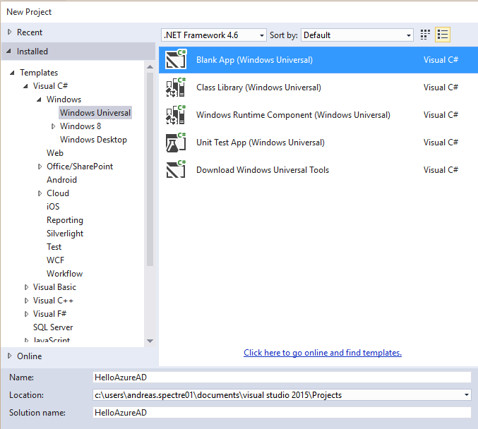
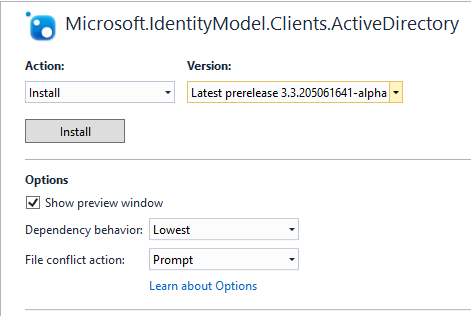
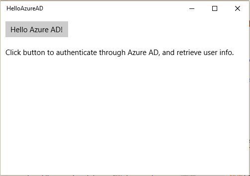
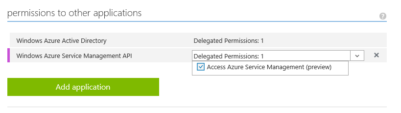
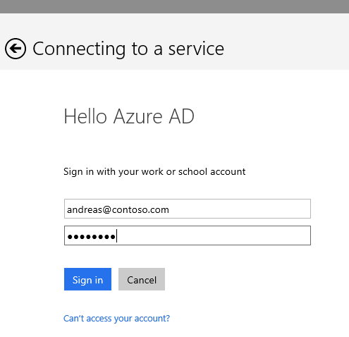
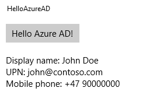

<properties
	pageTitle="HelloAzureAD"
	description="How to build a Windows Universal app authenticating a client through Azure AD."
	slug="helloazuread"
    order="500"
	keywords="Azure AD, AAD, Integration, Identity, Web App, AAD App Registration"
/>

This app is a Windows Universal app (built for Windows 10) that shows how to authenticate a user against an Azure Active Directory tenant. Subsequently the acquired token is used to execute a query against the Graph API to extract the user object. 

The code isn't what you would call complex, but as a heads up, you might not be familiar with some of the syntax used even though you know your C#.
For instance something like this line: 
```cs
lblHelloAADOutput.Text += $"Display name: {user.displayName}" + NewLine;
```

Don't worry. This is not a weird Windows 10 thing, it's part of C# 6, and is the equivalent of this line:
```cs
lblHelloAADOutput.Text += String.Format("Display name: {0}", user.displayName) 
    + System.Environment.NewLine;
```

Once you get into it I find the new approach more readable and easy to work with. (At the moment this means that if you're using Visual Studio 2013 the code probably isn't going to compile until you rewrite some of my code.)

All the code is available on GitHub:
[https://github.com/ahelland/AADGuide-CodeSamples](https://github.com/ahelland/AADGuide-CodeSamples)

Project name: HelloAzureAD

For starters create a new project in Visual Studio:


In addition to the already included packages you will need two more: Newtonsoft.Json &amp; ADAL



Do note that I am using the latest prerelease version of ADAL. The stable branch will not work for Universal apps in the current builds.

The interface consists of a single button, and a textblock displaying the output. The XAML (in MainPage.xaml) is really just a few short lines:
```xaml
<Grid Background="{ThemeResource ApplicationPageBackgroundThemeBrush}">
   <StackPanel>
      <Button Name="HelloAzureAD" 
         Content="Hello Azure AD!" 
         VerticalAlignment="Top" 
         Margin="10" 
         Click="HelloAzureAD_Click"/>
      <TextBlock Name="lblHelloAADOutput" 
         Text="Click button to authenticate through Azure AD, and retrieve user info." 
         Margin="10" 
         TextWrapping="Wrap"/>
   </StackPanel>
</Grid>
```
And it looks like this during runtime:


The autentication is triggered manually by clicking the button, but you can trigger it automatically during startup if you move the auth code to _App.xaml.cs_ instead. This would also allow you to terminate the app if authentication fails, but for a sample app I find that less valuable as a demo.

Before you can put in working variables in your app it needs to be registered in Azure AD first, so I suggest making sure you have the necessary client id ready by following the steps in _Register Native App_.

As an additional step you also need to set an extra permission in the Azure Portal to allow the Service Management API to be used:


This is a single tenant app, and will only work with your specific Azure AD tenant. This is a design choice to simplify things.

Start by setting the correct values for _tenant_ and _clientId_:
```cs
public sealed partial class MainPage : Page
{
    const string aadInstance = "https://login.microsoftonline.com/";
    const string ResourceId = "https://management.core.windows.net/";
    const string tenant = "contoso.onmicrosoft.com";
    const string clientId = "copy-from-Azure-Portal";
    private static AuthenticationContext authContext = null;
    private static Uri redirectURI = null;
```

ClientId is on the application page in the Azure Portal. Tenant is the name of your tenant. You can use either _contoso.onmicrosoft.com_ or _contoso.com_, but I prefer the onmicrosoft format because that remains static while other fqdns can be changed/added/removed.

You will also notice that there are no credentials hard coded into the app. This is because the user is the one acquiring the credentials to call the Graph API, and the resulting token is passed along to the app. The app is not able to authenticate on it's own in a silent manner. This is what is known as "passive authentication". The app caches the token though, so you will only have to authenticate on the first start, and the second time the app seemingly doesn't need the user any longer. (After a while the token will expire, and you will have to re-enter credentials.)

The following code will popup a window and do the authentication:
```cs
var authority = $"{aadInstance}{tenant}";
authContext = new AuthenticationContext(authority);

AuthenticationResult result = null;
try
{
   //PromptBehavior
   //Auto == prompt only when necessary (use cached token if it exists)
   //Always == useful for debug as you will always have to authenticate
   var authParms = new PlatformParameters(PromptBehavior.Auto, false);
   result = await authContext.AcquireTokenAsync(ResourceId, clientId, redirectURI, authParms);
}
```

This is what the user will see (the popup will overlay the app to give the feeling it's an integrated part of your app):



The token we receive from Azure AD contains some info about the user already, but I want to retrieve extra info that is not part of this token, so I need to call into the Graph API to do this.
I'm only interested in a few of these attributes so I have created a custom AADUser object with only the attributes I'm interested in:
```cs
public class AADUser
{
   public string displayName { get; set; }
   public string userPrincipalName { get; set; }
   public string mobile { get; set; }
}
```

This is in turn used when deserializing what the Graph API returns:
```cs
private static async Task<AADUser> GetUserInfo(string tenantId, string userId, string token)
{
    //Version 1.5 would be the newest version, but it throws 401s so using older version in meantime
    string graphRequest = $"https://graph.windows.net/{tenantId}/users/{userId}?api-version=2013-11-08";
    HttpClient client = new HttpClient();

    client.DefaultRequestHeaders.Authorization = new Windows.Web.Http.Headers.HttpCredentialsHeaderValue("Bearer", token);
    var response = await client.GetAsync(new Uri(graphRequest));

    string content = await response.Content.ReadAsStringAsync();
    var user = JsonConvert.DeserializeObject<AADUser>(content);
    return user;
}
```

If you want to see the entire user object in all it's glory you can either run Fiddler in the background, or inspect _content_ in debug mode. (It all goes over the wire, I'm just ignoring/removing things client side.)

In the UI you'll end up with something like this:



While this is a fairly restricted use case it demonstrates that doing authentication with Azure AD can be quite simple to do, and if you deploy apps in a setting where you can expect users to have access to Azure AD it's a very viable option. (I realize that some scenarios might be less suitable for such assumptions, but this is part of an Azure AD guide after all.) 

For more complex queries you might want to consider using the Graph Client Library, and this will be covered in other code samples.