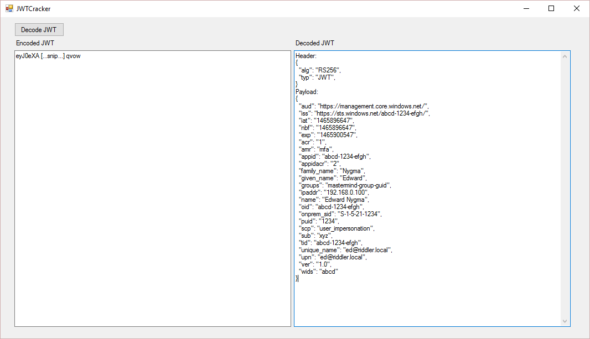

<properties
	pageTitle="JSON Web Tokens"
	description="How to peek inside of your JSON Web Tokens."
	slug="jwts"
	order="150"
	keywords="Azure AD, AAD, Integration, Identity, JWT, JSON Web Tokens, JWTCracker"
/>

This guide consists of a Windows Forms app for decoding JSON Web Tokens (JWTs).

Code on GitHub:
[https://github.com/ahelland/AADGuide-CodeSamples](https://github.com/ahelland/AADGuide-CodeSamples)

Project name: JwtCracker

### Introduction ###
If you run your Azure AD traffic through Fiddler or a similar proxy you will notice that the authentication header for most of your requests will contain something called a "Bearer" token which is a long and, on the surface, unreadable string. These tokens are the "keys to your kingdom" in the Azure Active Directory world. These "keys" come in a format called JSON Web Tokens, or JWTs for short. (Pronounced _"jots"_.)

Whether you have a mobile app hitting an API, or you sign in through a web page, the login process will have you ending up with a token with information about who you are and/or what you can access. For JWTs the tokens are the result of an OAuth flow (this includes OpenID Connect). The details of these flows are not necessary for understanding the JWT, but the short version of it is that different login methods will need to do different things back-end for the security to be implemented correctly.

For those familiar with earlier identity related protocols this is comparable to SAML, with a difference being that SAML tokens are XML-based. (SAML refers to both the tokens and the protocol naming wise, which can be confusing. JWT and OAuth are more specific; OAuth is the protocol, JWT is the token.)

Debugging token acquisitions can be a real hassle when you get errors thrown at you — either from refusing to grant you a token, or denying you access to what you want when you have a token. The token itself is not intended to be readable by humans and needs to be decoded first.

### Decoding JWTs ###
There are a couple of different options available if one wants to take a look at the contents of the token.

You can use an online tool to decode them: [https://jwt.io](https://jwt.io)

This works as intended, but you might not want to share all token details with a third-party. (Note that the token shouldn't contain passwords and similar secrets, but there might still be data better left on your local device.)

If you use Fiddler to capture traffic there's also the _"TextWizard"_ utility that is able to transform JWTs to mostly readable text. The token is a concatenation of Base64-encoded strings, so by splitting it into separate strings you can do a plain Base64 decode. The signature however is a hash of the header & payload + a secret, and will end up as unreadable characters in Fiddler.

Alternatively you can roll your own implementation.

### Implementing a JWT decoder in C# ###

If one has the need to decode the tokens without third-party tools there are standard libraries available from Microsoft that will enable you to do this.

**Note:**  
Your client should not rely on the information in the token. The client should use the token as is, and not make assumptions about the contents. 
A server however might, (as in most likely will), need to inspect the contents as part of the validation process. 
For troubleshooting, debugging, and learning purposes cracking it open to see what’s going on is valid.

There are also some scenarios in which one token is wrapped inside another token, and these might require you to unwrap the token for subsequent calls to a different endpoint. This would probably be more complex use cases, and there might be instructions specifying what you should and shouldn't do with such tokens. 

For validation purposes there are additional helper methods in the authentication libraries for AAD, so in many cases you do not need to inspect each and every claim, but this is not covered in this specific guide as this is about extracting everything from a JWT. (Examples can be seen in other code samples.)

The basic C# implementation for decoding a JWT token looks like the following code snippet:

```cs
using Newtonsoft.Json;
using Newtonsoft.Json.Linq;
using System.Security.Claims;
using System.IdentityModel.Tokens.Jwt;

//Assume the input is in a control called txtJwtIn,
//and the output will be placed in a control called txtJwtOut

var jwtHandler = new JwtSecurityTokenHandler();
var jwtInput = txtJwtIn.Text;

//Check if readable token (string is in a JWT format)
var readableToken = jwtHandler.CanReadToken(jwtInput);

if(readableToken != true)
{
  txtJwtOut.Text = "The token doesn't seem to be in a proper JWT format.";
}

if(readableToken == true)
{
  var token = jwtHandler.ReadJwtToken(jwtInput);
 
  //Extract the headers of the JWT
  var headers = token.Header;
  var jwtHeader = "{";

  foreach(var h in headers)
  {
	jwtHeader += '"' + h.Key + "\":\"" + h.Value + "\",";
  }

  jwtHeader += "}";
  txtJwtOut.Text = "Header:\r\n" + JToken.Parse(jwtHeader).ToString(Formatting.Indented);

  //Extract the payload of the JWT
  var claims = token.Claims;
  var jwtPayload = "{";
  foreach(Claim c in claims)
  {
	jwtPayload += '"' + c.Type + "\":\"" + c.Value + "\",";
  }
  jwtPayload += "}";
  txtJwtOut.Text += "\r\nPayload:\r\n" + JToken.Parse(jwtPayload).ToString(Formatting.Indented);  
}
```

Building a simple UI on top of this code produces a look like this:  


The complete code sample can be found in the JwtCracker directory:  
[https://github.com/ahelland/AADGuide-CodeSamples](https://github.com/ahelland/AADGuide-CodeSamples)

Interpreting the contents of the token is out of scope for this utility, but this serves as recommended reading:  
[https://auth0.com/learn/json-web-tokens/](https://auth0.com/learn/json-web-tokens/)
