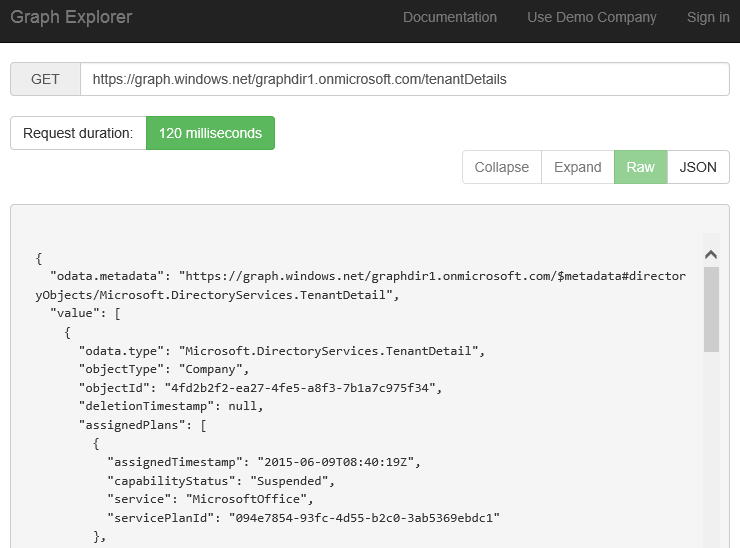
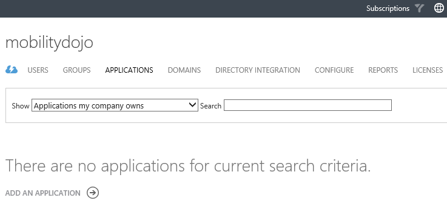

<properties
	pageTitle="Overview"
	description="Overview of how to integrate with Azure AD."
	slug="overview"
    order="100"
	keywords="Azure AD, AAD, Integration, Identity"
/>

Azure AD can do a lot of neat things for you without a single line of code on your part, and even if you don't know the difference between Java and Javascript there are still benefits to be had for you. 
However it's even better when you are able to hack together a byte or two on your own, and leverage it in your apps as an identity platform and/or user directory.

I'm certainly not going to drill into the details of the history of authentication and authorization in .Net, but the framework as such has offered a subsystem for handling user identities and login for many years. If you've ever used it you might have banged your head occasionally in frustration over what you can and cannot do with. While Azure AD doesn't completely remove the need for thinking through identity in your apps it does abstract away some of the details, and more importantly - the actual handling and storage of user accounts is not reliant on your coding efforts any longer.

Microsoft has provided official sample code that I have found valuable, and used in my integration efforts so you might want to check out that if there is something specific you're looking for:
[https://github.com/AzureADSamples](https://github.com/AzureADSamples)

There is also a new section in the official Azure documentation geared towards developers:
[http://aka.ms/aaddev](http://aka.ms/aaddev)

So what can I bring to the table not already being delivered straight from the horse's mouth?

Well, there are parts of the dev story that I will leave to the Redmond crew, and I try not to rehash what you can copy &amp; paste from the official sources. I also believe that more examples, and more how-to's never hurt anyone, so in the subsections of this part of the AAD guide I will try to do my take on this large topic. I'm going to cover some of the integrations you can do, and provide some samples of how it works. I'm not able to demonstrate every single way you can hook into AAD, and all scenarios, but I will try to build a mix of basic getting started snippets and larger scenarios based on what I have experienced a need for in the stuff I have built.

Azure AD can be used both in client side apps and web applications, and does not require you to be running a Microsoft stack in any way. You can use it on Android and iOS, and you can use Javascript or PHP as your language of choice if you prefer.

Let's start by sorting out some terms that will be used throughout these samples.

### Single tenant application ###
A single tenant application is as the name implies an application where you are both the publisher/developer of the app as well as the user. This means you might make different assumptions about the security, and "hardcode" the tenant name instead of having logic to detect which tenant you're dealing with.

### Multi-tenant application ###
The name is a give away for this type of app as well. You are the publisher/developer of an app, and external entities are the users of the app. You may still use it for internal consumption, but the system treats you as an external client as well. The most notable difference is that an administrator must consent to the app being used before end-users can login to a multi-tenant app.

### Active Directory Authentication Library (ADAL) ###
I will be using the acronym ADAL throughout for this library. This is an SDK for authenticating using Azure AD, and is provided by Microsoft.
It is available for .Net, iOS, Android, Javascript, Java and NodeJS (hoping I haven't missed anyone on my list).

This library focuses on helping you acquire tokens that can be used subsequently to retrieve info from Azure AD, either directly through the Graph API or the Graph Client (see below).

Azure AD is based on standards like OAuth and OpenID, (or WS-Federation if you haven't had time to move to the newer bits), so you're not forced to use the library. It does make things a little bit simpler though if you don't happen to be an identity ninja already, in which case you probably have your own library for handling tokens :)

In Visual Studio and .Net you are most likely to download this through NuGet, but if you use different IDEs you can download it from Github as well:
[https://github.com/AzureAD](https://github.com/AzureAD)

### Graph API ###
The directory data in Azure AD is exposed through a RESTful interface called the Graph API. Where "classic Active Directory" uses LDAP to expose the data, Azure AD exposes the data through an API built based on REST "standards". (I know that it's technically not a standard, but it seems to be fairly standardized what is meant by being RESTful even if the details might differ between implementations.) You may find yourself accessing the underlying API through a layer of SDKs and wrappers to abstract the low-level http requests, but you may interface with it directly as well should you choose to. (For simple operations a clean call directly can make for more readable code.) Since it only requires support for HTTP on your side most languages that supports Internet traffic will be able to leverage it.

If you want to explore the API without coding, or assist you while coding, a graphical (pun not intended) interface is also available:
[https://graphexplorer.cloudapp.net](https://graphexplorer.cloudapp.net)

### Azure Active Directory Graph Client Library ###
Interfacing directly with the Graph API can sometimes be a bit cumbersome if you try to do things like pulling down a list of hundreds of users and groups forcing you to implement pagination, or running Linq queries to retrieve only a subset of users. To simplify some of these tasks Microsoft also provides a Graph Client Library which works as a wrapper around the REST calls. Depending on what you are trying to build this might make some operations a lot simpler. Do note that this library is not entirely in sync with the actual Graph API so you might see things implemented on the back-end before these wrappers are updated. 

You're not forced in any way to do everything through the Graph Client just because you've have imported it though, so you can mix and match with raw http calls if you like.
 
### Getting Started ###
The first thing you need to do to access the Azure AD back-end in your applications is having a tenant in Azure AD. If you haven't already done so hop on over to [https://azure.microsoft.com/en-us/services/active-directory](https://azure.microsoft.com/en-us/services/active-directory), and get yourself hooked up with one of your own.

The next step is registering your app in Azure AD. In the same way that you need to have a user account in Azure AD to login as a user, your app needs to have an account of sorts as well. More on this in the menu on your right hand side.

The goal is to change the look of this list to a list with actual entries in it, so let's get cracking on that part :)
