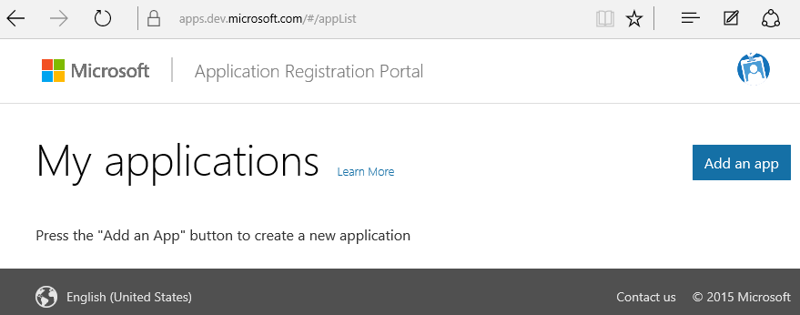
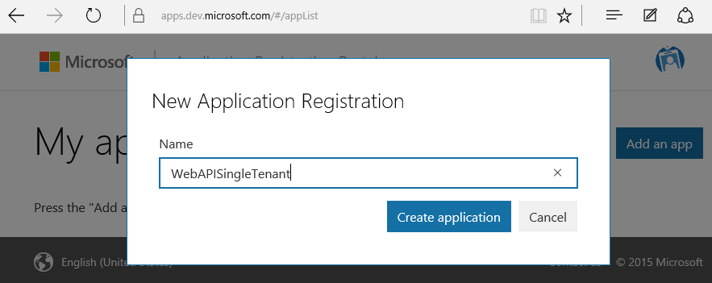
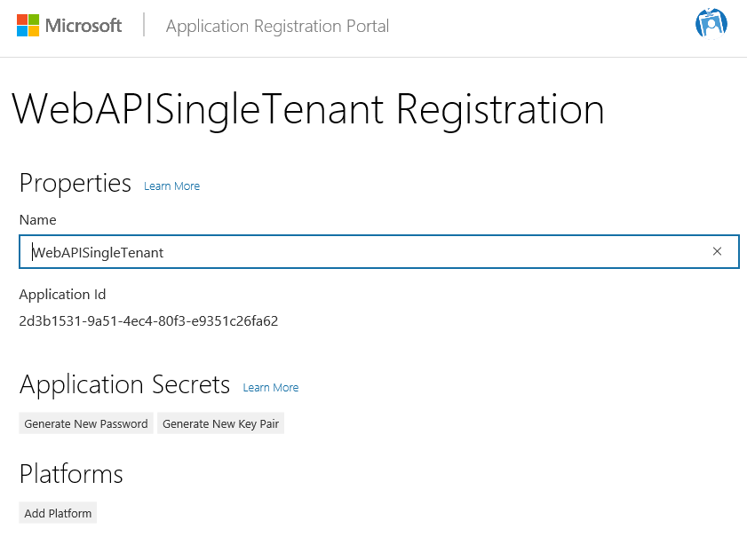
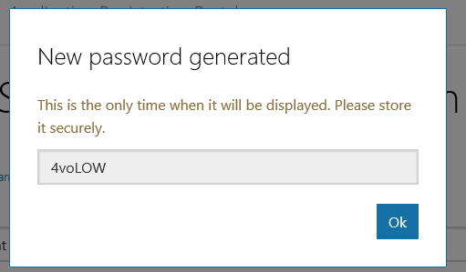
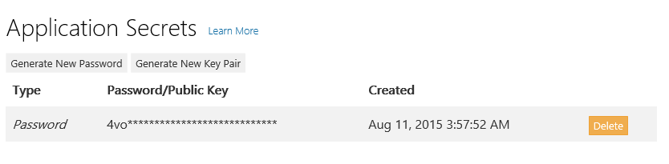
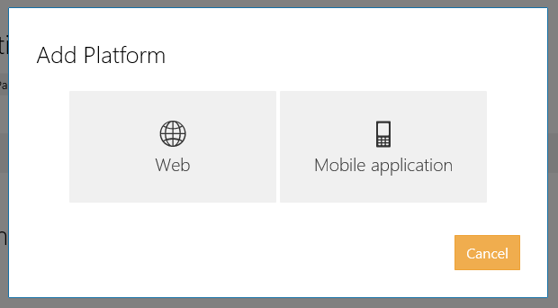
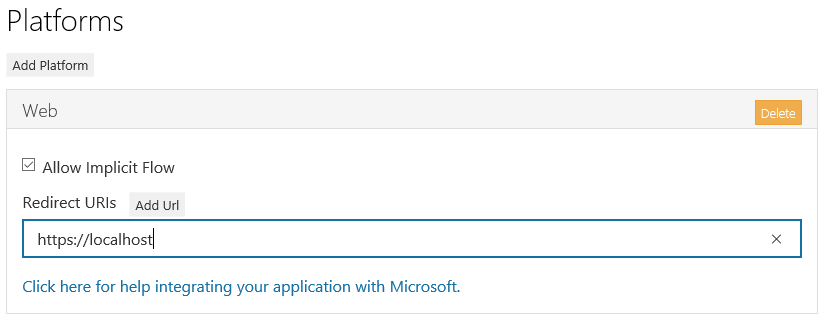
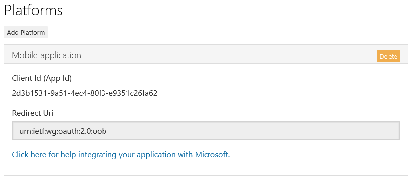
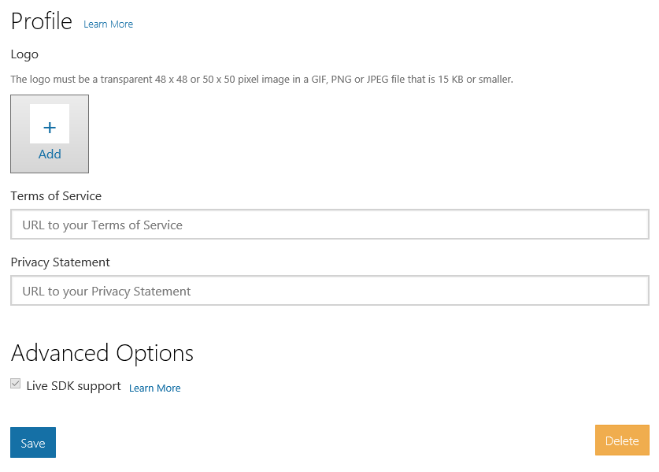

<properties
	pageTitle="Register App v2"
	description="How to register an app with the v2 model in Azure AD."
	slug="registerappv2"
    order="350"
	keywords="Azure AD, AAD, Integration, Identity, App v2, AAD App Registration"
/>

The current approach for registering apps in the Azure Management Portal differentiate between web apps and native apps, and leads you through different registration flows depending on your choice. This can sometimes lead to multiple app entries for scenarios where the logical design makes it more correct to describe it as one "app" with multiple entry points. Let's say you have both a website, a web-based API, and native clients for mobile devices. Yes, those have different ways to authenticate with Azure AD, but they are part of the same bundle.

A new method for registering apps in Azure AD intends to remove some of this fuzz, and make it easier/more intuitive. This is part of an initiative called the v2 app model, which brings a range of other improvements to the table as well, but this walkthrough covers the registration part only.

**Note: As of August 2015 this registration experience, and the v2 app model is in a public preview. This means that not everything from v1 is functional, and it might not be the right choice for an app you intend to place in production in the immediate future. It is however very well suited for learning and proof-of-concepts while waiting for GA, and if you know that launch time for your project is sometime into the future anyways it may be better to start on this path now.**

### Using the Application Registration Portal to register a app ###
Head over to [https://apps.dev.microsoft.com](https://apps.dev.microsoft.com), and sign in with a Microsoft account, or an Azure AD account.

Choose "Add an app", and specify a name for your app first. Note that this really is the only step you need to create the app compared to the wizards in the v1 flow which required multiple steps. 

By default you will only have a client id, so you can't do much before you have done a few extra steps. All the options are explored here, but adapt this to what is actually required for the app you are creating. From top to bottom the first option is to click "Generate New Password".  This creates a client secret we can use along with the client id in trusted apps. (Similar to a "Web App" in v1 terms where the secret is stored in a web.config or something similar.)

You can have multiple passwords if you like, and this should be employed if/when you roll over your secrets (changing passwords). You can also create a certificate to use for authentication if you want to beef up the security by clicking "Generate New Key Pair".

For adding clients (untrusted apps) you will want to click "Add Platform".

To simplify further settings you can choose between different types; for the moment there's only two, but more might come later. Selecting "Web" gives us the ability to define a redirect URI. This might seem to be in conflict with using web apps as an example for needing a client secret, but the secret only enables server side auth. To authenticate the users interactively you need a URI the browser redirects to after the users have been sent to Azure AD for typing in their credentials.

If we choose to add a "Mobile application" we also need to define a redirect URI. It is usually not a web-style link, but rather a platform specific redirect. 

You can add a logo for your app, as well as terms of service and privacy statements should you need it.

That's about it for a basic registration currently. Future versions may include more options and settings.
