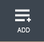
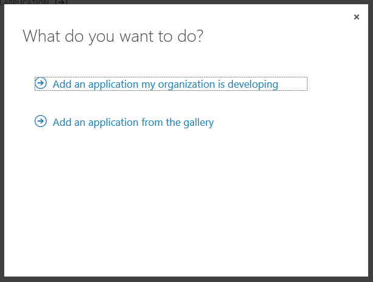
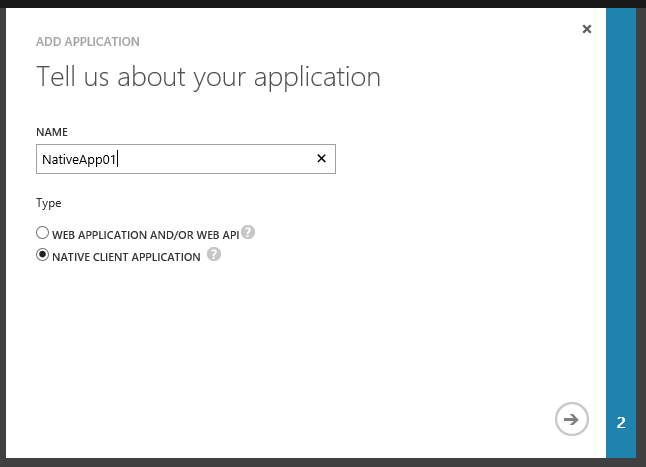
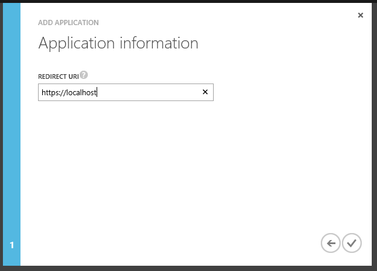
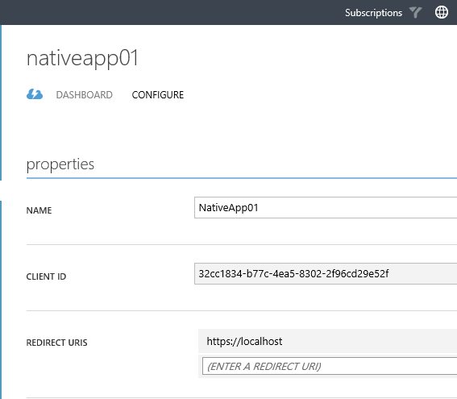
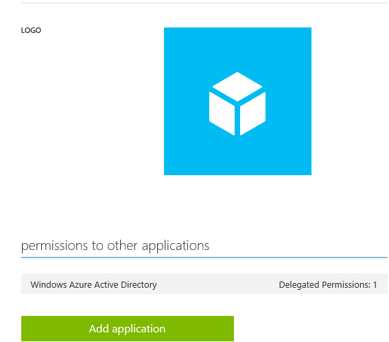
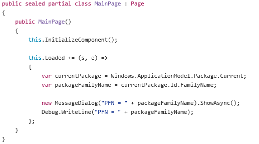

<properties
	pageTitle="Register Native App"
	description="How to register a native app in Azure AD."
	slug="registernativeapp"
    order="300"
	keywords="Azure AD, AAD, Integration, Identity, Web App, AAD App Registration"
/>

Before your native app can use Azure AD as the identity back-end it needs to be registered in Azure AD. This is done both to ensure that not every random app out there can hook into an AAD tenant, and to configure some of the mechanics needed for it to actually work with the necessary redirects.

Unlike web apps there are currently no tooling in Visual Studio to have the Azure AD stuff taken care of through "magic" so you will have to use the Azure Portal for registering your native app.

### Using the Azure Portal to register a native app ###
For now only the "old" Azure Portal supports Azure AD:
[https://manage.windowsazure.com](https://manage.windowsazure.com)

Navigate to "Active Directory". Select the tenant you want to register this app in - you can have several tenants, and I highly recommend at least one separate dev/test tenant in addition to a production tenant.
Go to the "Applications" tab and click "Add" at the bottom:

Next you get to choose if you're developing something yourself, or if it's an app someone else has already made. For the purposes of this guide you'll want to select option 1 "Add an application my organization is developing".

You then choose what type of app you're registering.

For a native app you need to configure a redirect uri. This is the place in the app that you will be redirected to after authenticating. This is a value you don't have available until you've either tried logging in and failed, (and copy the uri from the error message), or done a breakpoint and debug print after building the app. So you can leave it to a fictitious value for now. 

Afterwards you can navigate to the "Configure" tab for the app you just registered.

You will need to add additional "Redirect Uris" to make things work with a visual login. For console apps, which technically are also a native app, you don't need this. If you have a Universal app however you can login, and then you will need to configure this. To find out the correct uri to use you can insert something like the following lines of code in your app (this is from a XAML-based app):

The redirect uri will then be ms-app:// + the value you retrieved.

The "permissions to other applications" section can be left at it's defaults for now. Different apps will have different requirements here, so we'll revisit this section when we have an app that needs it to be altered.