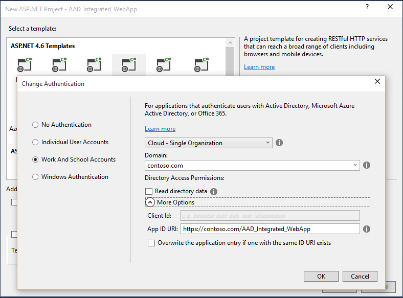
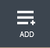
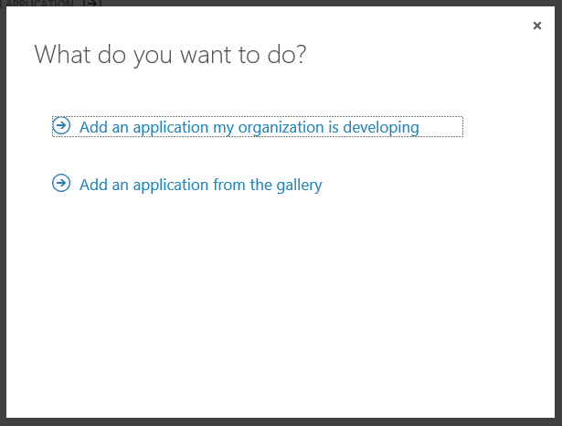
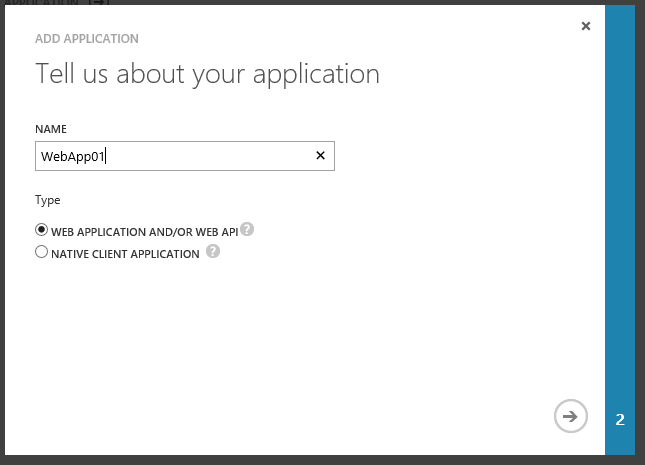
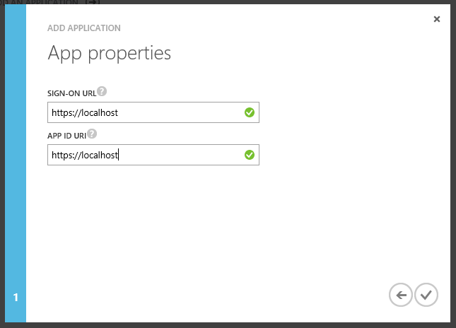
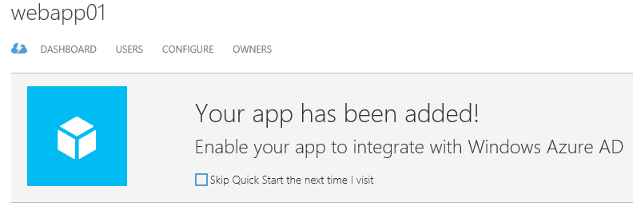
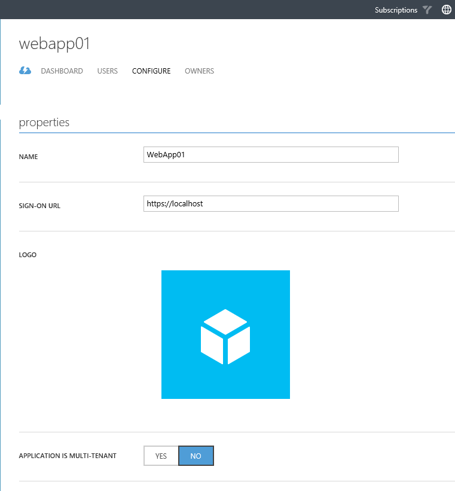
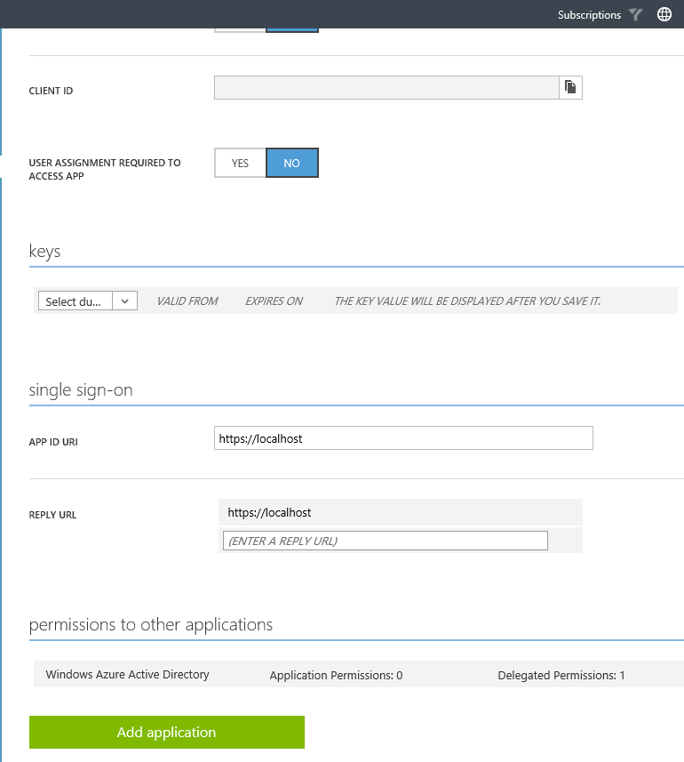

<properties
	pageTitle="Register Web App"
	description="How to register a web app in Azure AD."
	slug="registerwebapp"
    order="200"
	keywords="Azure AD, AAD, Integration, Identity, Web App, AAD App Registration"
/>

Before your web app can use Azure AD as the identity back-end it needs to be registered in Azure AD. This is done both to ensure that not every random app out there can hook into an AAD tenant, and to configure some of the mechanics needed for it to actually work with the necessary redirects.

Registering a web app for use with Azure Active Directory can basically be done in two ways - through the Azure Portal or the tooling in Visual Studio.

If you want to get started in a jiffy the tooling in Visual Studio is great. It takes care of making some decisions for you, and it plumbs the necessary lines of code directly into your solution/project. This also means there is less control delegated to you, so this may or may not be what you want.

### Using the tooling in Visual Studio to register a web app ###
Here's that it looks like when you build a new web app using the templates, and opt to change the authentication:

To make sure everything is working with your tenant, and things are in place, running through setting up the default template and deploying it is a great test, and you can easily build on top of this afterwards to make it a "proper" web site. Alternatively you can select "No Authentication", and do things entirely manual if you prefer that.

### Using the Azure Portal to register a web app ###
For now only the "old" Azure Portal supports Azure AD:
[https://manage.windowsazure.com](https://manage.windowsazure.com)

Navigate to "Active Directory". Select the tenant you want to register this app in - you can have several tenants, and I highly recommend at least one separate dev/test tenant in addition to a production tenant.
Go to the "Applications" tab and click "Add" at the bottom: 

Next you get to choose if you're developing something yourself, or if it's an app someone else has already made. For the purposes of this guide you'll want to select option 1 "Add an application my organization is developing".

You then choose what type of app you're registering.

You need to define two properties when registering a web app.

**Sign-On URL**
This is the URL in the browser from where you sign in. I've just set it to https://localhost, because that is a valid URL for development purposes. For a public web app you would probably go for https://www.contoso.com or something similar. (Yes, you can set it to a public DNS name and still be able to debug locally.)

**APP ID URI**
This setting looks like a valid URL, but doesn't have to actually be resolvable. It is the unique identifier for your app, so a more appropriate URI than https://localhost is something like https://contoso.onmicrosoft.com/WebApp01. Using either the naked tenant name (xyz.onmicrosoft.com), or a custom domain name you have added is a good approach. It needs to be unique across your tenant.

The sign-on url is really only relevant to the login process so if you only use the app for talking to the Graph API in the background it doesn't really matter what it's set to. If you have a multi-tenant app you will not be able to consent without configuring the urls correctly though, so you might want to take some consideration to have something sensible there just in case.

And we're done adding the app.

Afterwards you can navigate to the "Configure" tab for the app you just registered.

Part 1

Part 2

ClientID is something you will need when configuring your app. This is basically the "username" of the app.

You should also create a key if you intend to authenticate as an app, as this acts as the "password" of the app. (For instance if the back-end needs to extract data from AAD without user intervention.)

You will probably also need to add additional "Reply Urls" to make things work across dev and production. The reply url is the url that AAD will return to after authenticating the login. As a security measure this needs to be configured so I'm not able to redirect to a random page that shouldn't be allowed to read the properties of the user.

The "permissions to other applications" section can be left at it's defaults for now. Different apps will have different requirements here, so we'll revisit this section when we have an app that needs it to be altered.