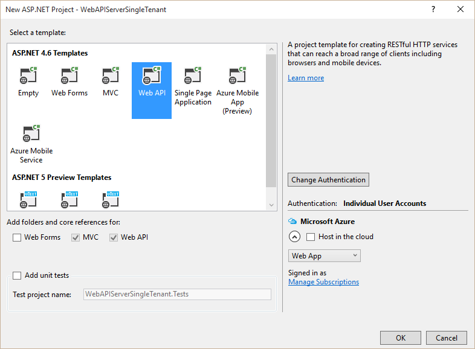
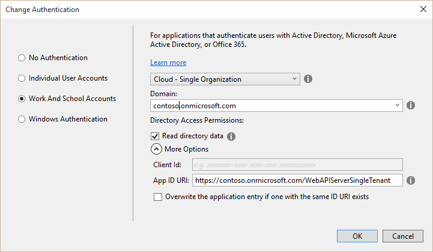

<properties
	pageTitle="WebApiSingleTenant"
	description="How to protect a web api with Azure AD, and combine it with authentication for the API help page."
	slug="webapisingletenant"
    order="700"
	keywords="Azure AD, AAD, Integration, Identity, Web API"
/>

This guide consists of a server side web app and a client side Windows Universal app. Azure AD authentication is added to both the Web API endpoint and the Web App itself.

Code on GitHub:
[https://github.com/ahelland/AADGuide-CodeSamples](https://github.com/ahelland/AADGuide-CodeSamples)

Project name: WebAPIServerSingleTenant and WebAPIClientSingleTenant

### Introduction ###
RESTful APIs are all the rage nowadays. Everything should be served through an API, and instead of creating thick clients on each platform all going through to the back-end database, a unified back-end exposing functionality to lightweight front-ends for each client platform are exposed instead.

Exposing data through APIs might not be that hard, depending on how your data is structured. Or if you're unlucky and you have a legacy system never intended for the web originally it might require a herculean effort to rewire the interface. Your mileage may vary, but this guide will not address this part though. For the sake of discussion we will assume that you have an API that is, or can be made, available in some form over the http protocol.

An important part of exposing an API is deciding on how to secure access to the API.
- You could have an open API available for everyone to use without any authentication at all. 
- You could require the API consumer to have credentials, (think hardcoded username/password), for accessing the API. 
- You could require the API consumer to obtain credentials by asking the end-user to login.
- You could have different levels of access depending on which credentials are passed in. 

These decision points are really no different than the concepts of authentication and authorization we have experienced for many years as end-users so it should be familiar.

This guide will dive into the following scenarios:
- You have an MVC-based website which exposes a Web API secured with Azure Active Directory.
- You have a Windows Universal app consuming this API by having a user login with their Azure AD credentials.
- You have a section of the website authenticating users, and exposing data from the API with the site's credentials.

You could make this scenario more complex based on your needs. Should the API be in a separate web site, and be purely non-graphical? Should the UI expose a view for testing the API in the browser, or are API consumers required to create code and/or test with Fiddler? Should this API support multiple Azure AD tenants where different consumers each bring their own tenant? 

For this specific setup we aim to make things simple. We support a single tenant. We don't provide a testing UI in the browser. We create a client consuming the API. We also protect the API documentation on the web site by using Azure AD.

### Web API Server ###
There are multiple parts involved in making this work. Let's start with creating the website containing the API.

The templates in Visual Studio aren't bad as a starting point, even though some extra "fluff" is added that we don't need. So I have based the project on that, while removing some of the overhead. Hit the _New Project_ button/link in Visual Studio:

Click "Change Authentication".

Select "Work And School Accounts" and type in your tenant name followed by signing in to Azure AD.


After the wizard has loaded up everything you can delete _projectreadme.html_ and _ValuesController.cs_.

The wizard handles the necessary steps for registering the web app in Azure AD, so you don't have to manually do this. The results should however match what you would get if you worked through the "Register Web App" guide.

_App_Start/Startup.Auth.cs_ contains the code driving the Azure AD authentication. For now, we don't need to touch anything in this file as it will just work. We will however need to return to it later as it's only configured to work for the API at the moment.

The variables specific to your Azure AD tenant are located in web.config:
```xml
<add key="ida:Tenant" value="contoso.onmicrosoft.com" />
<add key="ida:Audience" value="https://contoso.onmicrosoft.com/WebAPIServerSingleTenant" />
<add key="ida:ClientID" value="guid" />
<add key="ida:Password" value="hex string" />
```
If you have downloaded the sample code from GitHub you will need to substitute these appSettings with your own. (To create/retrieve the necessary values follow the steps in the "Register web app" guide.)

Next thing we need to do is add a controller for the web API; let's call this "AADController"


Then you should add some code to this controller:
```cs
namespace WebAPIServerSingleTenant.Controllers
{
    [Authorize]
    public class AADController : ApiController
    {
        [HttpGet]
        public IEnumerable<string> Hello()
        {
            return new string[] { "World" };
        }
    }
}
```

Notice the "[Authorize]" attribute decorating the class. This means that everything exposed in this API requires authentication to work.

The API exposes a single method for GET which returns a static string so it's not very sophisticated, but that's besides the point.

We can verify that this works by attempting to opening the following path in a browser:


This doesn't actually return the string since we have not authenticated, but it validates that we have authentication in place, and that the API responds so we consider the test successful.

Notice that I'm using the Edge browser in Windows 10 for testing this. This is because Internet Explorer doesn't render json responses by default, instead opting to open the file. (IE being "deprecated" is another point, but that's not why I have chosen Edge for this test.)

### Web API Client ###

At this point we can turn to creating a native client to interact with the API proper.

Create a Windows Universal blank app in Visual Studio:


Register the app in the Azure portal as outlined in the "Register Native App" guide.

Let's add a light-weight "user interface" by editing MainPage.xaml:
```xml
<Grid Background="{ThemeResource ApplicationPageBackgroundThemeBrush}">
    <StackPanel>
        <Button Name="HelloWebApi" 
        Content="Hello Web API!" 
        VerticalAlignment="Top" 
        Margin="10" 
        Click="HelloWebApi_Click"/>
        <TextBlock Name="lblHelloAPIOutput" 
        Text="Click button to authenticate through Azure AD, and retrieve the output from a predefined web api." 
        Margin="10" 
        TextWrapping="Wrap"/>
    </StackPanel>
</Grid>
```

Add the _ADAL_ and _NewtonSoft.Json_ NuGet packages. (Note that we're using version 6.0.8 of NewtonSoft, and the latest alpha of ADAL.)

Based on the registration process done in the Azure portal we define a couple of constants in _MainPage.xaml.cs_:
```cs
//Replace 'Contoso' with your tenant name
const string aadInstance = "https://login.microsoftonline.com/";
const string ResourceId = "https://contoso.onmicrosoft.com/WebAPIServerSingleTenant";
const string tenant = "contoso.onmicrosoft.com";
const string clientId = "copy-from-Azure-Portal";
const string baseApiUrl = "localhost:44300";
private static AuthenticationContext authContext = null;
private static Uri redirectURI = null;
```

Make sure the ResourceId matches the name of your web app.

Add a method called "GetToken" that will acquire a token (in other words, authenticate the user):
```cs
private static async Task<AuthenticationResult> GetToken()
{
    var authority = $"{aadInstance}{tenant}";
    authContext = new AuthenticationContext(authority);

    AuthenticationResult result = null;
    try
    {
        //PromptBehavior
        //Auto == prompt only when necessary (use cached token if it exists)
        //Always == useful for debug as you will always have to authenticate
        var authParms = new PlatformParameters(PromptBehavior.Auto, false);
        result = await authContext.AcquireTokenAsync(ResourceId, clientId, redirectURI, authParms);
    }
    catch (Exception x)
    {
        if (x.Message == "User canceled authentication")
        {
            // Do nothing
        }
        return null;
    }

    return result;
}
```

Next thing we need to do is to add the event handler for the button in our UI:
```cs
private async void HelloWebApi_Click(object sender, RoutedEventArgs e)
{
    var authResult = await GetToken();
    string token = authResult?.AccessToken;
    if (token == null)
    {
        MessageDialog dialog = new MessageDialog($"If the error continues, please contact your administrator.", 
        "Sorry, an error occurred while signing you in.");
        await dialog.ShowAsync();
    }
    if (token != null)
    {
        HttpClient client = new HttpClient();
        string apiRequest = $"https://{baseApiUrl}/api/AAD";
        client.DefaultRequestHeaders.Authorization = new Windows.Web.Http.Headers.HttpCredentialsHeaderValue("Bearer", token);
        var response = await client.GetAsync(new Uri(apiRequest));
        string content = await response.Content.ReadAsStringAsync();
        lblHelloAPIOutput.Text = content.ToString();
    }
}
```
You will notice that a request is made to localhost, which means the web API must be started before the client. The authentication token is attached to the header and passed along to the API as part of the connection process.

If you try to run the app right now you will be served up with an error after authenticating, so a few more things need to be done before hitting F5.

First thing is to navigate to the settings of the "WebAPIServerSingleTenant" app and add permission for the "Azure Service Management" API:


This ensures that the server app is visible to your other apps. If this doesn't work, the next step will not work either.

Next step is to add the "WebAPIServerSingleTenant" as an app you can access in your native app. Navigate to the "WebAPIClientSingleTenant" app and add "WebAPIServerSingleTenant" to your approved list (tick the checkbox too):


Yes, this possibly feels a little backwards, but this is the way we connect the dots between the apps.

The next step is to add the reply address of the native app to the "Redirect URIs" setting in the portal. You can either go with the approach in "HelloAzureAD" which involves adding some extra code to retrieve the PFN, or you can just run the app, have it fail the first time and copy the address from the error message.

Once that it is in place you should be able to run the app, authenticate, and have it print out the return value:


### Securing the API docs page ###

At this point you have a functioning API, as well as a means to access it, so you can pile on functionality any way you like on both ends - even more advanced stuff than "Hello World" :) Asides from the basic client there is however still a missing piece of the puzzle in the server side implementation. This piece is all server side, so for now you can close the client app.

When you use the Web API template in Visual Studio it automatically includes the _Microsoft.AspNet.WebApi.HelpPage_ NuGet package, (which previously had to be added manually). This package generates some basic documentation for your APIs so users can browse a web page to read up on the interface before they start assembling their client. This is accessible in this web app by navigating to https://localhost:44300/Help

You will notice that currently this info is available to anyone who accesses the page. Now this might be how you want it to be, but since this sample deals with securing access to resources by using Azure AD it makes sense for us to want to secure this area of the web site so that only those who have credentials for using the API can read about how it works.

The setup we will use is that the root of the web page should be open for anyone, but when they click the "API" link we will attempt to authenticate the user. (You can apply the [Authorize] attribute on the root, but it's not a very good user experience for most web sites to have the login page kick in immediately so only do this if you have SSO in-place where the user is not expected to type in credentials.) The user will login the same way as in the app, with the same set of credentials, but the default configuration of our web app only accepts authentication attempts from an API client. Logging in through the web browser isn't supported yet.

We'll start by requiring authentication on our doc pages.
Open the _HelpController.cs_ file (located under _Areas/HelpPage/Controllers_) and add the Authorize attribute:
```cs
[System.Web.Mvc.Authorize]
public class HelpController : Controller
```

You need to prefix the Authorize attribute with System.Web.Mvc because otherwise it will be an ambiguous reference between System.Web.Mvc and System.Web.Http. Mvc is used for views, and Http is used for APIs. (Thus System.Web.Http is the one used in our API Controller).

Previously it was mentioned that _App_Start/Startup.Auth.cs_ contained the config for the AAD auth, so this is the place we want to add some code to have an additional method for gaining access. The way this is done is basically by combining the code the Web API template generated for us and the code generated from creating a web app without an API.

```cs
public void ConfigureAuth(IAppBuilder app)
{
    #region WebAPI
    app.UseWindowsAzureActiveDirectoryBearerAuthentication(
        new WindowsAzureActiveDirectoryBearerAuthenticationOptions
        {
            Tenant = tenant,
            TokenValidationParameters = new TokenValidationParameters
            {
                ValidAudience = resourceId
            },
        });
    #endregion
    #region Web-based login
        ApplicationDbContext db = new ApplicationDbContext();
    app.SetDefaultSignInAsAuthenticationType(CookieAuthenticationDefaults.AuthenticationType);
    app.UseCookieAuthentication(new CookieAuthenticationOptions());
    app.UseOpenIdConnectAuthentication(
    new OpenIdConnectAuthenticationOptions
    {
        ClientId = clientId,
        Authority = Authority,
        PostLogoutRedirectUri = postLogoutRedirectUri,
        Notifications = new OpenIdConnectAuthenticationNotifications()
        {
            // If there is a code in the OpenID Connect response, 
            //redeem it for an access token and refresh token, and store those away.
            AuthorizationCodeReceived = (context) =>
            {
                var code = context.Code;
                ClientCredential credential = new ClientCredential(clientId, appKey);
                string signedInUserID = 
                    context.AuthenticationTicket.Identity.FindFirst(ClaimTypes.NameIdentifier).Value;
                Microsoft.IdentityModel.Clients.ActiveDirectory.AuthenticationContext authContext = 
                    new Microsoft.IdentityModel.Clients.ActiveDirectory.AuthenticationContext
                        (Authority, new ADALTokenCache(signedInUserID));
                AuthenticationResult result = authContext.AcquireTokenByAuthorizationCode(
                code, new System.Uri(System.Web.HttpContext.Current.Request.Url.GetLeftPart(
                    System.UriPartial.Path)), credential, graphResourceId);
                return System.Threading.Tasks.Task.FromResult(0);
            }
        }
    });
    #endregion
}
```

The first region sets up the Web API by enabling Bearer Authentication. The second region sets up the flow for accepting tokens generated by interactively signing in. (More on different flow types in a soon-to-be-written guide.)

You will notice that _ApplicationDbContext_ and _AdalTokenCache_ is currently preventing you from building the code.

Let's get to it after adding a few more NuGet packages to resolve the other "missing bits". Entity Framework and a couple of Owin packages need to be added - let's just add them all to _packages.config_ and have Visual Studio sort it out:
```xml
<?xml version="1.0" encoding="utf-8"?>
<packages>
  <package id="Antlr" version="3.4.1.9004" targetFramework="net46" />
  <package id="bootstrap" version="3.0.0" targetFramework="net46" />
  <package id="EntityFramework" version="6.1.3" targetFramework="net46" />
  <package id="jQuery" version="1.10.2" targetFramework="net46" />
  <package id="Microsoft.AspNet.Mvc" version="5.2.3" targetFramework="net46" />
  <package id="Microsoft.AspNet.Razor" version="3.2.3" targetFramework="net46" />
  <package id="Microsoft.AspNet.Web.Optimization" version="1.1.3" targetFramework="net46" />
  <package id="Microsoft.AspNet.WebApi" version="5.2.3" targetFramework="net46" />
  <package id="Microsoft.AspNet.WebApi.Client" version="5.2.3" targetFramework="net46" />
  <package id="Microsoft.AspNet.WebApi.Core" version="5.2.3" targetFramework="net46" />
  <package id="Microsoft.AspNet.WebApi.HelpPage" version="5.2.3" targetFramework="net46" />
  <package id="Microsoft.AspNet.WebApi.WebHost" version="5.2.3" targetFramework="net46" />
  <package id="Microsoft.AspNet.WebPages" version="3.2.3" targetFramework="net46" />
  <package id="Microsoft.IdentityModel.Clients.ActiveDirectory" version="2.18.206251556" targetFramework="net46" />
  <package id="Microsoft.IdentityModel.Protocol.Extensions" version="1.0.0" targetFramework="net46" />
  <package id="Microsoft.Owin" version="3.0.1" targetFramework="net46" />
  <package id="Microsoft.Owin.Host.SystemWeb" version="3.0.1" targetFramework="net46" />
  <package id="Microsoft.Owin.Security" version="3.0.1" targetFramework="net46" />
  <package id="Microsoft.Owin.Security.ActiveDirectory" version="3.0.1" targetFramework="net46" />
  <package id="Microsoft.Owin.Security.Cookies" version="3.0.1" targetFramework="net46" />
  <package id="Microsoft.Owin.Security.Jwt" version="3.0.1" targetFramework="net46" />
  <package id="Microsoft.Owin.Security.OAuth" version="3.0.1" targetFramework="net46" />
  <package id="Microsoft.Owin.Security.OpenIdConnect" version="3.0.1" targetFramework="net46" />
  <package id="Microsoft.Web.Infrastructure" version="1.0.0.0" targetFramework="net46" />
  <package id="Modernizr" version="2.6.2" targetFramework="net46" />
  <package id="Newtonsoft.Json" version="6.0.4" targetFramework="net46" />
  <package id="Owin" version="1.0" targetFramework="net46" />
  <package id="Respond" version="1.2.0" targetFramework="net46" />
  <package id="System.IdentityModel.Tokens.Jwt" version="4.0.0" targetFramework="net46" />
  <package id="WebGrease" version="1.5.2" targetFramework="net46" />
</packages>
```

Add _ApplicationDbContext.cs_ to the _Models_ folder. This will be the database context for the tokencache (a circular reference, I know). It doesn't have to be based on Entity Framework, and in this case I'm not mapping it to an actual database either.

```cs
using System;
using System.ComponentModel.DataAnnotations;
using System.Data.Entity;

namespace WebAPIServerSingleTenant.Models
{
    public class ApplicationDbContext : DbContext
    {
        public ApplicationDbContext()
            : base("DefaultConnection")
            {}

        public DbSet<UserTokenCache> UserTokenCacheList { get; set; }
    }

    public class UserTokenCache
    {
        [Key]
        public int UserTokenCacheId { get; set; }
        public string webUserUniqueId { get; set; }
        public byte[] cacheBits { get; set; }
        public DateTime LastWrite { get; set; }
    }
}
```

Then we need to add _AdalTokenCache.cs_ to the _Models_ folder. It's roughly 100 lines of code, so to maintain the readability of this guide it's in the GitHub repo for you.

This cache does what it says. It keeps track of your token so it's not necessary to call out to Azure AD for each call you make, and this is also pretty much boilerplate code from the template.

If you go to the Help area now, you should be redirected to a login page, and then see the same thing as before we protected the page:


As a byproduct it is now possible to test the API directly in the browser, at least for GET requests:


If this behavior is considered a bonus or not could probably go both ways, but as long as you have a valid token you are good to go in this manner.

There you have it. You should now have a protected API along with the documentation, as well as a proof-of-concept type client to consume the API in a secure manner.
